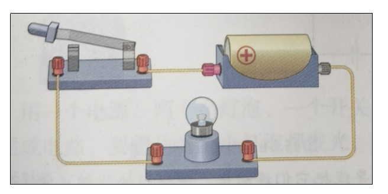

# 第一章：电学基础  

## 1.电学基础概念

### 1.1 电流

>**原子由原子核和核外电子组成**

>**电流是电荷在单位时间内通过导体横截面的流动量**

**对于金属导体来说，电流就是电子在电路中的移动。电流的单位是安培（A），1A代表1秒内有1库仑（电荷量单位，字母是C，1C是6.242*1018个电子）电子通过导体横截面**

- **实际的电流方向是负电荷（电子）的移动方向**
- **电学上定义的电流方向是正电荷定向流动的方向**

**电流的换算关系：1A=1000毫安（mA），1mA=1000微安（uA），1uA=1000纳安（nA）**

>**常见的电流**

---

### 1.2 电压

**电压（Voltage）是电场施加在电荷上的力量，使其在电路中移动的能量。它也被称为电势差**

**电压的单位是伏特（V），1伏特代表电场对1C电荷做1焦耳功（1V * 1A * 1s=1J）。电压的换算关系：1Kv=1000V，1V=1000mV，1mV=1000μV**

>**常见的电压**

---

### 1.3 电阻

**电阻：导体对电流的阻碍作用就叫该导体的电阻。可以用下图形象的表示**

**在物理学中，用电阻来表示导体对电流阻碍作用的大小。导体的电阻越大，表示导体对电流的阻碍作用越大。导体的电阻通常用字母R表示，单位是欧姆，简称欧，符号是Ω**

**电阻的单位换算：1KΩ=1000Ω=10^3Ω ，1MΩ=1000000Ω=10^6Ω**

---

### 1.4 电路

>**电路的构成**

**物理学中将电池这类提供电能的装置叫做电源，将灯泡、电动机、蜂鸣器等这类消耗电能的装置叫做用电器**

**电源、用电器，再加上导线，往往还有开关，组成了电流可以流过的路径——电路**

>**电路图符号**

**画图时，如果把电源、用电器等元件原样画出，既麻烦又不清楚。为了方便研究，人们通常用图形符号来表示这些元件**

>**通路、断路、短路**

- **人们把正常接通的电路，即用电器能够工作的电路叫做通路**
- **电路中如果某处被切断，电路中就不会有电流流过，这种情况叫做断路**
- **直接用导线将电源的正、负极连接起来，这种情况叫做短路**

---

### 1.5 直流电与交流电

---

### 1.6 弱电与强电

**弱电一般电压较低，国家规定的安全电压是交流36V以下、直流24V以下。弱电通常用于直流电路（3.3V、5V、12V）、音频和视频线路、网络线路、电话线等。弱电常用于信号传递**

**强电一般电压较高，比如，220V的家用电，1000多伏及以上的高压电。强电常用于传递能量**

**一般弱电平台用手直接触摸不会造成人身危险，最多静电击穿元器件挂掉；但是强电平台一定不能用手直接触摸，会有生命危险**

---

### 1.7 家庭电路

**我国家庭电路的电压是220V**

**上图是比较简单的家庭电路示意图，由两根进户线、电能表、总开关、保险装置、用电器、导线等组成。输电线进户后首先接到电能表上，电能表用来显示所消耗的电能。接下来是全户用电的总开关。当家庭电路需要修理时，必须断开总开关，这时室内全部电路与外面的输电线分离，可以保证施工人员的安全**

**总开关后面是保险装置。熔丝（俗称保险丝）是简易保险装置，装在保险盒内。电流过大时熔丝会熔化，切断电路，对用电器起到保护作用**

**现在新建居民楼电路中的保险装置一般采用空气开关，空气开关安装在电能表后，当电路中的电流过大时，空气开关自动断开，切断电路，俗称跳闸**

---

## 2.常用定律

### 2.1 欧姆定律(I=U/R)

---

### 2.2 功率计算(P=UI)

---

### 2.3 焦耳定律(Q=I^2 *Rt)

---

### 2.4 串联电路与并联电路

>**串联电路**

>**并联电路**

