# 第二章：常见电子元器件

**电子元器件按照封装不同，又分为插件式和贴片式**

**插件式元器件：是指通过引脚插入电路板的元器件。插件元器件的引脚可以通过焊接或卡扣等方式与电路板连接**

**贴片式元器件：是指直接焊接在电路板表面的元器件。贴片元器件的焊接是通过元器件的焊盘与电路板上的焊盘进行连接来实现的**

---

## 1.电路仿真软件

**学习电子元器件之前，介绍一款模拟电路仿真软件——CircuitJS，这是一款运行在JS环境的电路仿真软件，轻量级，适合初学者了解电路原理**

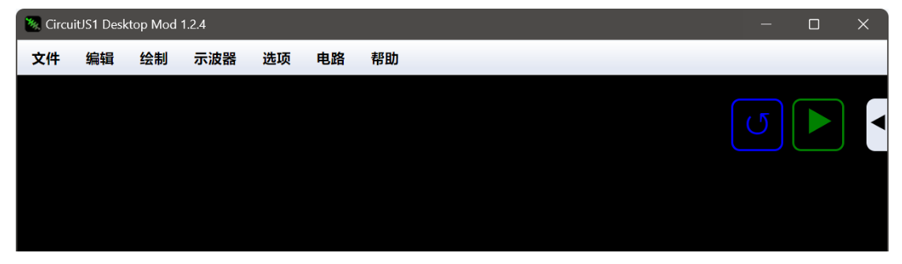

>**添加元器件快捷键**

|功能|快捷键|
|-|-|
|电阻|R|
|电容|C|
|电感|L|
|开关|S|
|地|G|
|直流电压源|v|
|导线|w|
|文本注释|t|

---

## 2.电阻器

**电阻器是产生电阻的元器件。主要作用是阻碍导体中电流的流动。碳膜电阻内部结构图，如下图所示**

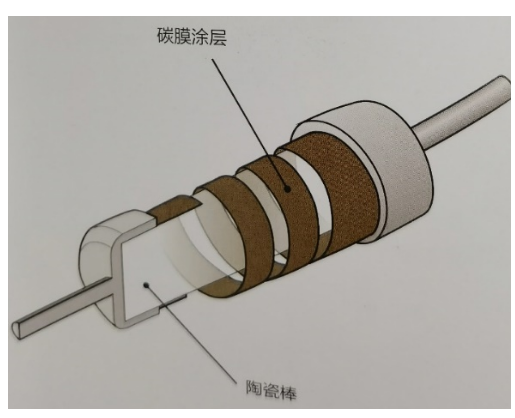

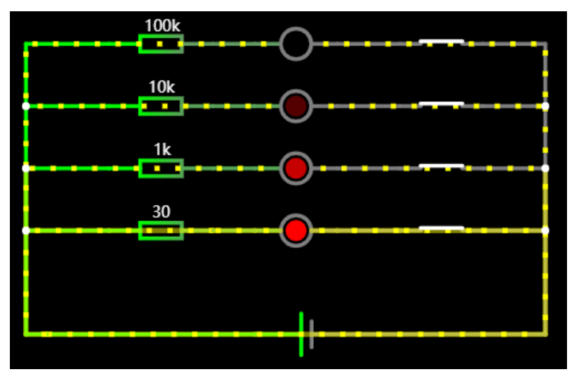

---

### 2.1 电阻的参数

**我们在生产环境中了解电阻时，需要重点关注如下几个参数：阻值、功率、精度**

>**阻值** 
>**电阻的阻值越大，表示阻碍电流的能力越强。反之，电阻阻值越小，表示阻碍电流的能力越弱。我们需要根据实际电路的需要去选择合适阻值的电阻**

>**功率** 
>**电阻器的额定功率：指电阻在正常气候条件下（如大气压、环境温度等），长时间连续安全工作可耗散或可承受的最大功率。例如电阻功率是1/4w，电阻阻值是1k，那么根据公式P=I2R=>0.25W= I2 * 1000Ω=》I=0.015A =15mA，通过该电阻的电流长时间操作15mA，电阻容易损坏**

>**精度** 
>**一般情况下，电阻的精度一般有1%和5%，精密的要0.1%等。精度越高，价格越贵。0.1%的价格大约是1%的十倍，1%的价格大约是5%的1.3倍**

---

### 2.2 固定电阻

**一般电路用的电阻都是固定电阻，这一类电阻也是我们生活中最常见的。按照生产工艺大概可以分为以下几类：碳膜电阻、金属膜电阻、线绕电阻、厚膜电阻、薄膜电阻**

>**碳膜电阻：主要用于家用电器等民用领域**

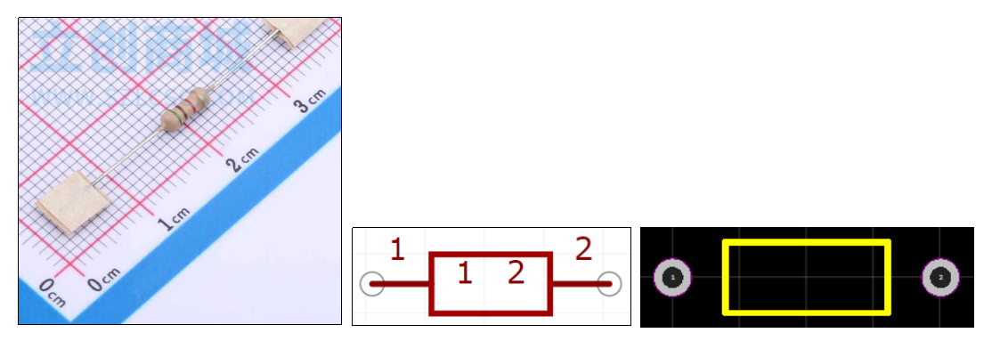

>**金属膜电阻：金属膜电阻精度较高，一般多用于精密仪器或医疗设备等领域**

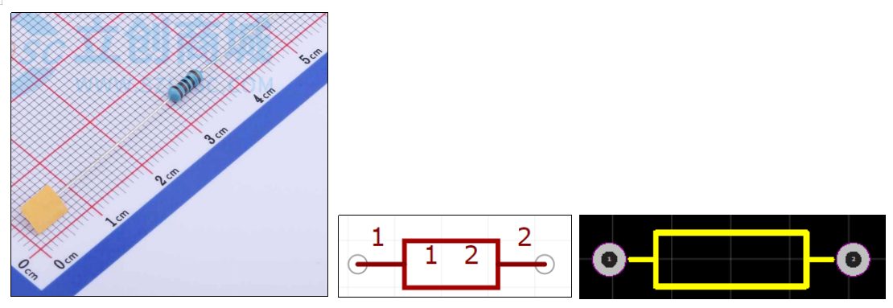

>**绕线电阻：就是由金属丝紧密绕在一个非导电的陶瓷、玻璃或塑料芯子上制成。这些电阻的主要特点是它们能承受较高的功率（例如5w，10w，20w），具有非常低的温度系数，且提供高度的精度和稳定性，常用于高功率，过载保护或者环境恶劣的场合。由于这类电阻电感较高，对于高频响应非常差，不能用于高频场合**

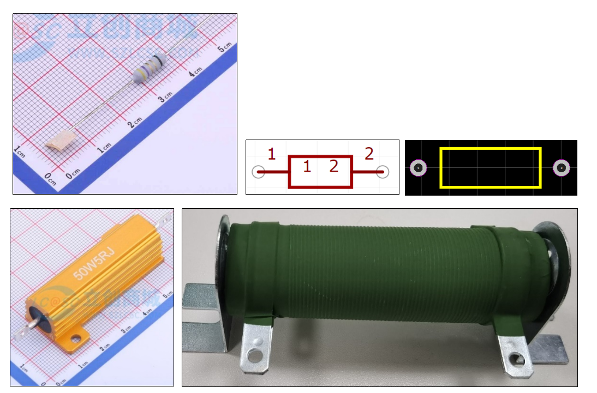

>**厚膜电阻：厚膜电阻成本较低，精度不高，所以广泛应用于主流电子产品**

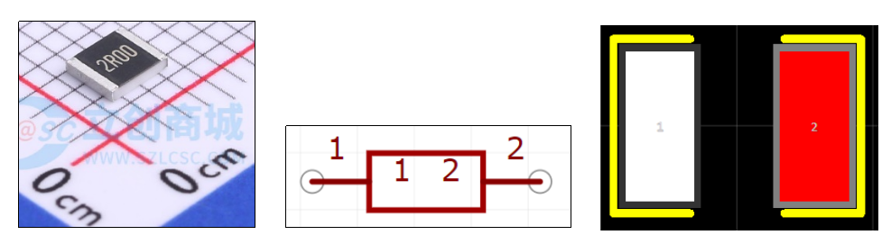

>**薄膜电阻：薄膜电阻成本更高，精度也更高，更多的应用于精密仪器，军工航空等高精度要求场合**

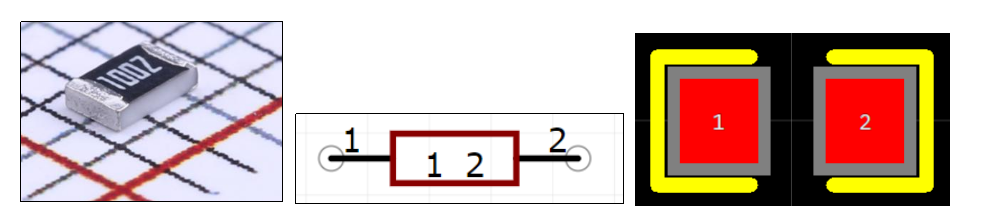

---

### 2.3 可变电阻

**可变电阻的生产工艺和固定电阻类似，主要是薄膜电阻，金属膜电阻和线绕电阻，相比于固定电阻，主要是多了一个调节电阻的指针，常见的封装类型有旋转式电位器，滑动式电位器，微调电位器，多转电位器等，如下图：**

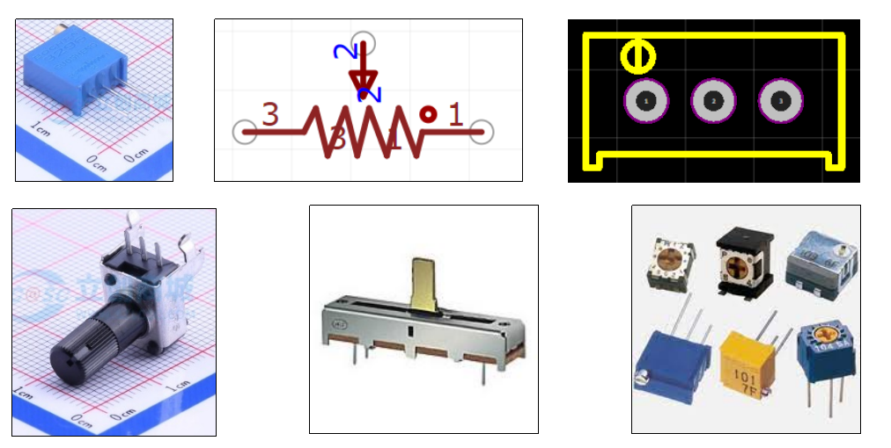

>**可变电阻一般用于家庭、商业、舞台灯光等场景中，通过控制电阻的阻值来调节灯光的亮度和颜色**

---

### 2.4 特种电阻

**特种电阻一般分为：光敏电阻、压敏电阻**

>**光敏电阻工作原理：光敏电阻随着光照强度的增加，阻值降低。一般用在光线检测、照明控制、报警系统等场合**

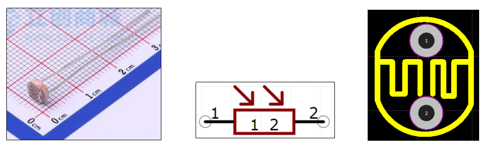

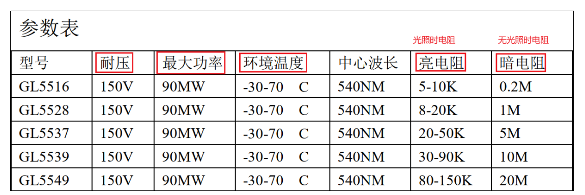

>**压敏电阻工作原理：压敏电阻两端电压超过额定电压时，阻值降低。一般用在吸收过电压、浪涌保护和雷击保护等场合**

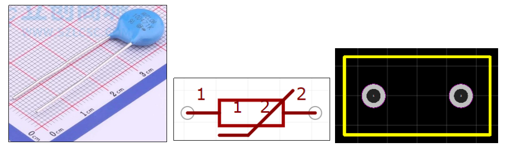

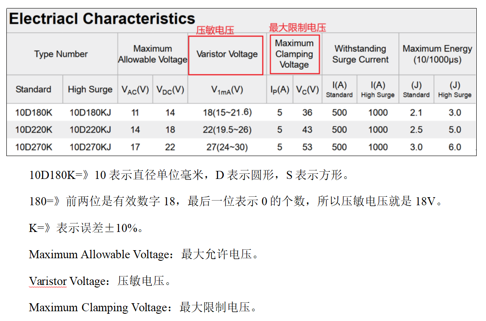

---

### 2.5 电阻的阻值识别

**电阻的阻值识别方式主要有：直标法、两位有效数字电阻读法、三位有效数字电阻读法、精密电阻读法、色环法**

**实际上不如直接用万用表测来的快**

>**直标法：就是将电阻器的类别、标称阻值、允许偏差及额定功率等直接标注在电阻器的外表面上**

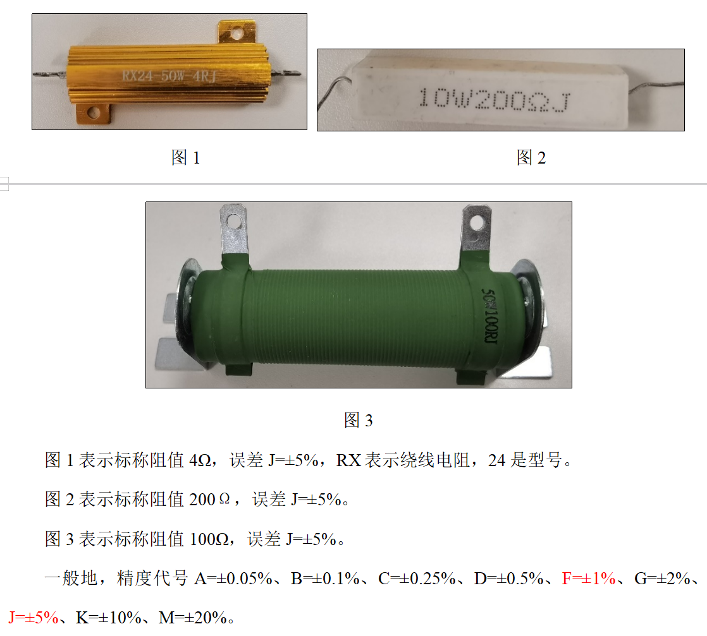

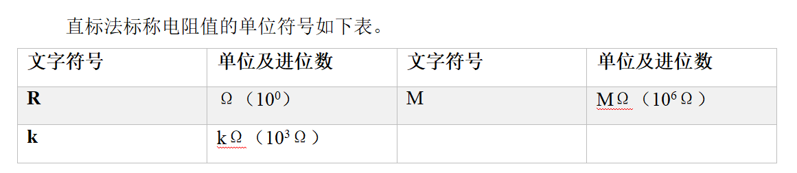

>**两位有效数字电阻读法：就是在电阻体上用三位数字来标明其阻值，一般用于±5%精度的电阻。它的前2有效数字，第3位表示在有效数字后面所加“0”的个数，这一位不会出现字母。其中R表示小数点**

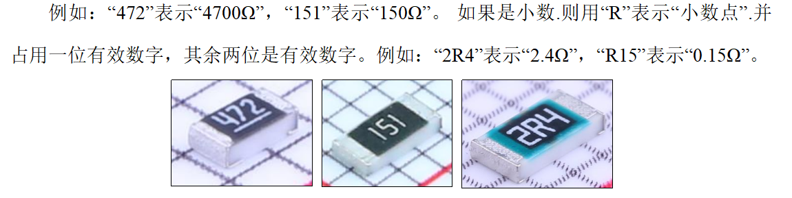

>**三位有效数字电阻读法：就是在电阻体上用四位数字来标明其阻值，一般用于±1%精度的电阻。它的前3位为有效数字，第4位表示在有效数字后面所加“0”的个数，这一位不会出现字母。其中R表示小数点**

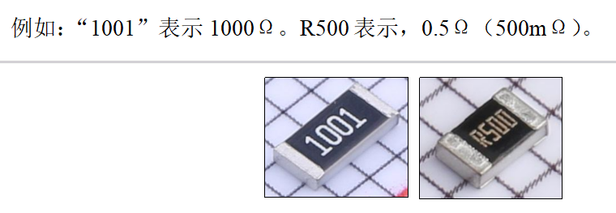

>**精密电阻读法：是由两位数字加一位字母表示，一般用于为±0.1%精度的电阻，例如：01B等**

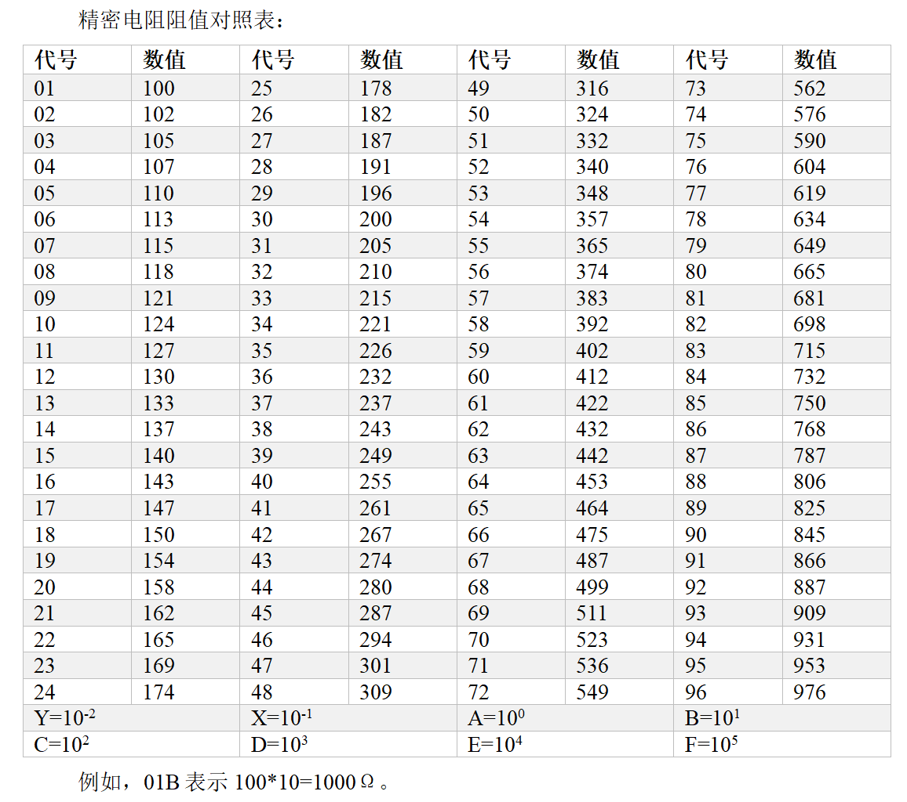

>**色环法：通过在电阻的体表涂上不同颜色的环带来表示电阻的阻值和精度。一般来说，电阻器上会有4个或5个色环，每个色环代表一个数字或一个特定的系数。根据色环的位置和颜色可以确定电阻的阻值和精度**

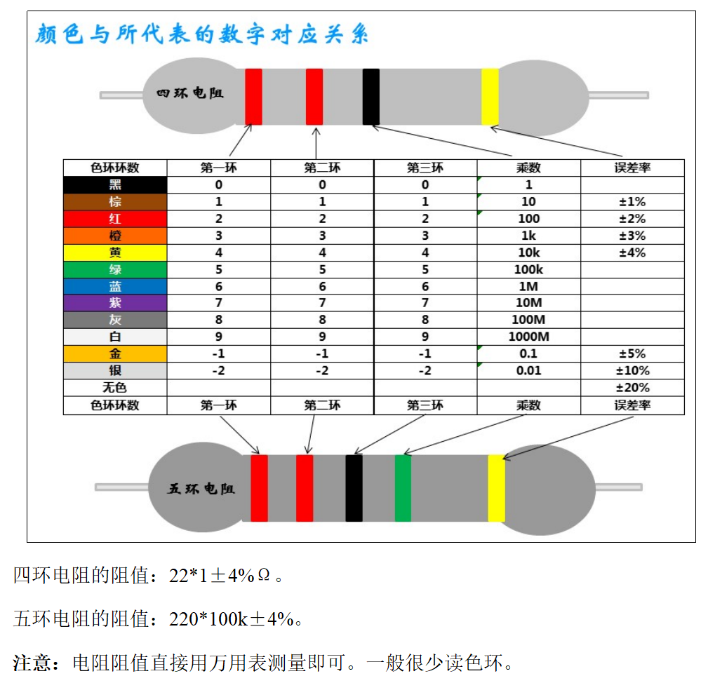

---

## 3.电容器

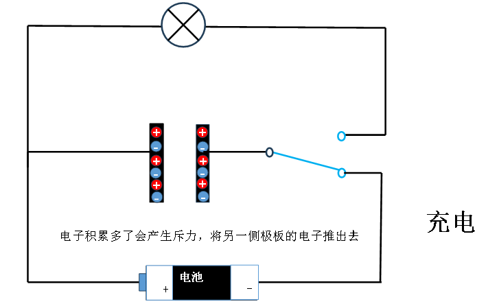

**电容，顾名思义，就是电荷的容器，单位为法（F），1F代表升压1V可以储存1C电量。F这个单位比较大，我们通常用mF或者uF作为单位使用**

**电容的特性：主要是充电、放电、隔直、通交**

**1 法拉 = 10^3毫法（mF） = 10^6微法（uF） =  10^9 纳法（nF）=10^12皮法（pF）**

**电容对交流信号的阻碍作用称为容抗，它与交流信号的频率和电容量有关。电容容抗XC=1/2πfC 。其中，f表示电信号（指一定频率的交流电）的频率，C表示电容器的容量**

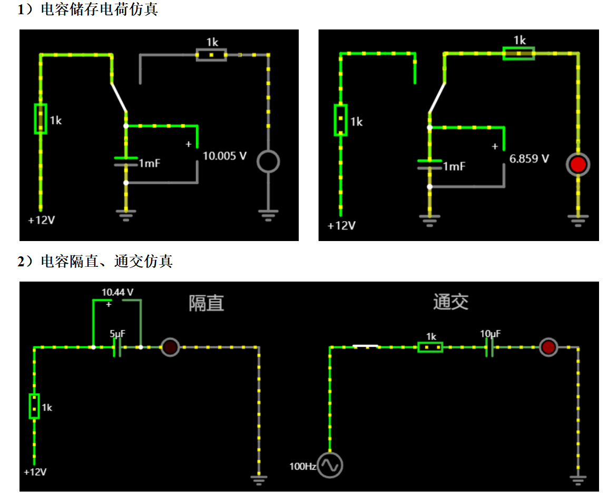

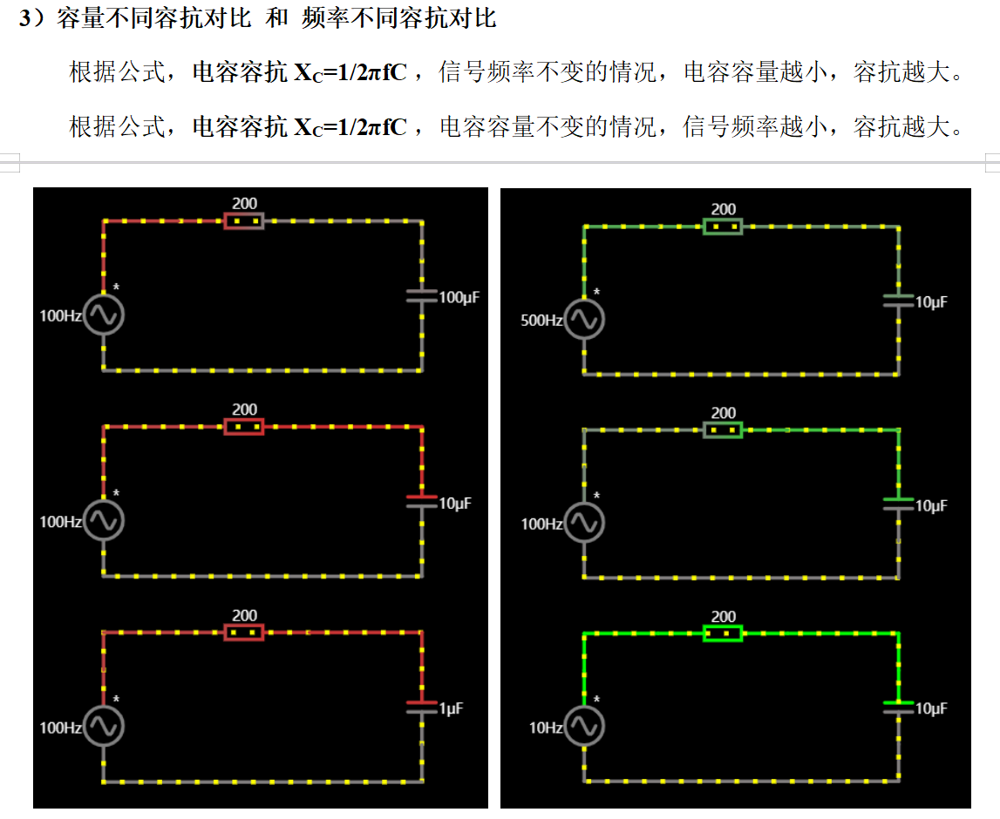

---

### 3.1 电容的参数

**电容主要关注：容量、耐压值、容差**

>**电容的容量：电容容量的大小表示能贮存电能的大小**

>**电容的耐压值：2.5V、4V、6.3V、10V、16V、20V、25V、35V、50V、63V、80V、100V、220V、250V、400V、600V、1000V等一般使用过程中，我们最高只使用到600V的耐压值。而无极性的电容耐压值偏高，有极性的电容耐压值偏低。根据经验：标称耐压值越高，则电容的体积越大**

>**电容的容差：电容的绝对容差是指电容器的实际容量与额定容量之间的差值。即B：±0.1pF、C：±0.25pF、D：±0.5pF、Y：±1pF、A：±1.5pF、V：±5pF**

---

### 3.2 固定电容

**固定电容可分为：电解电容和瓷片电容**

**无极性电容和有极性电容都可以看作固定电容，两者的主要差异是容量和对于电容两端极性要求不同。无极性电容对于两端极性没有要求，但一般容量较小，可以用于交流电。极性电容造价便宜，容量大，只能用于直流电场景**

**固定电容按照工艺区分，电解电容（有极性）、瓷片电容，主要就是在价格和容量间做取舍**

>**电解电容：储能、滤波**

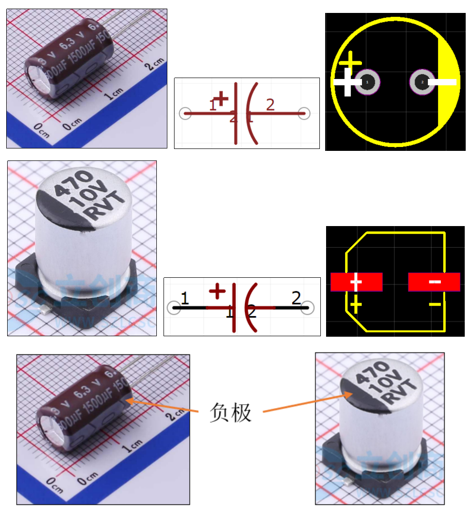

>**瓷片电容**

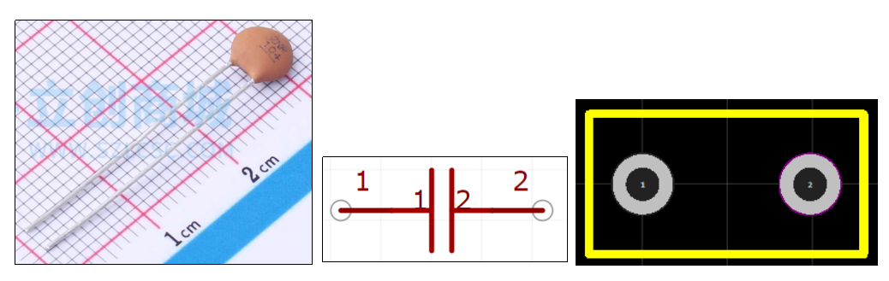

---

### 3.3 可变电容

**可变电容和固定电容工艺类似，但是一般有一个调节装置可以调节两个极片之间的相对面积，从而达到调节电容大小的目的。一般很少使用**

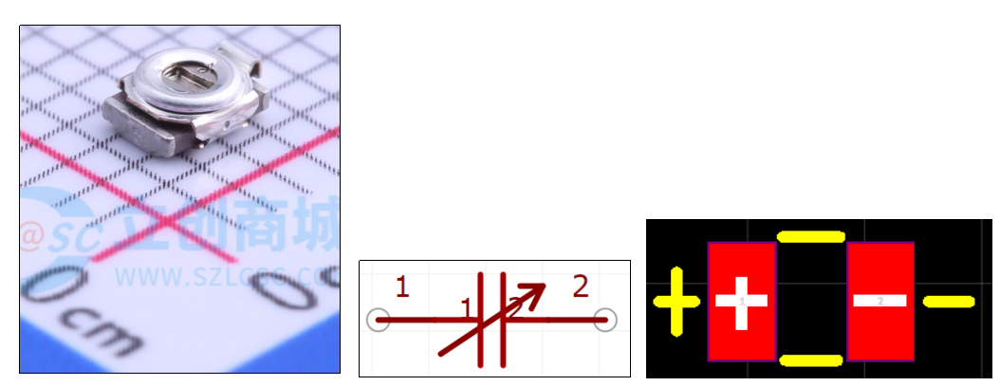

---

### 3.4 超级电容

**这是一种特殊的电容，介于传统电容器和电池之间，容量大，充电快，可以反复充放电，一般用于汽车领域、备用电源领域、风力发电领域等。比如：电路中电源突然断电，可以通过超级电容给后续电路瞬间提供电压，保证系统有时间切换到备用电源上**

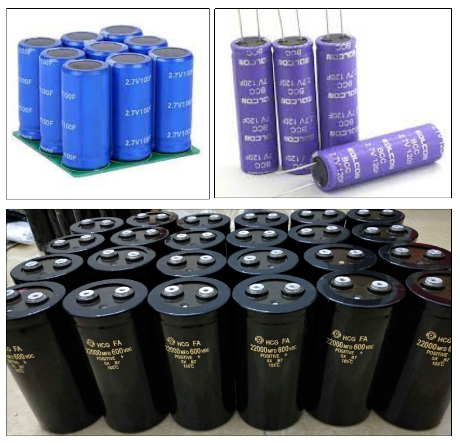

---

### 3.5 电容的容量识别

**电容的容量识别一般分为：直接标注法、乘方数表示法、字母表示法、贴片电解电容(特殊)**

**电容F的单位容量非常大，所以我们看到的电容一般都是mF、uF、nF、pF的单位**

**1F=10^3mF=10^6uF=10^9 nF=10^12pF**

>**直接标注法：一般电解电容表面直接显示的容值就是实际的容值，例如0.01uF、0.047uF、33pF、45pF**

>**乘方数表示法：一般陶瓷电容用三位数字表示容值。它的首位和二位为有效数字，第三位表示在有效数字后面所加“0”的个数。拼接完的容值单位是pF**

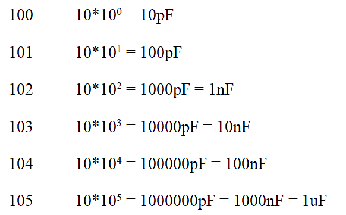

>**字母表示法：这是国际电工会推荐标注的方法，使用的标注字母有4个，即p、n、U、m，分别表示pF、nF、UF、mF，用2-4个数字和1个字母表示电容量，字母前为容量的整数，字母后为容量的小数，如lp5、4u7、3n9分别表示1.5pF、4.7uF、3.9nF**

>**贴片电解电容：贴片电解电容，上表示的数字就直接读取，单位是uF**

---

## 4.电感器

**电感是用一根具有绝缘外皮的铜丝缠绕几圈形成。电感对直流电流没有阻碍作用，对交流电流阻碍作用大。电感的单位为亨（H），也是一个很大的单位，我们常用的电感级别都是mH或者uH。电感的换算单位：1H = 10^3mH；1mH = 10^3uH**

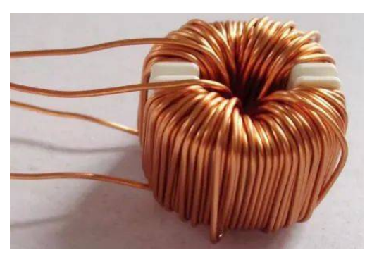

**对于嵌入式软件工程师了解电感的两个作用即可：电感储能、电感通直隔交**

>**电感储能：电感以磁场的方式储存电能**

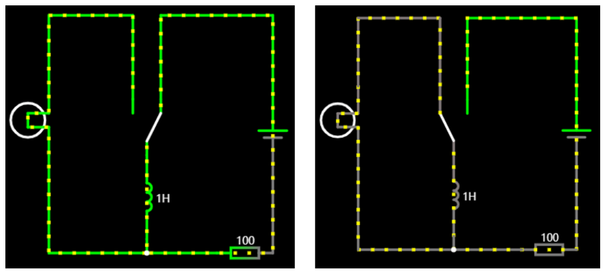

>**电感通直阻交：电感对直流电流的阻碍力几乎为0（电感储能完毕之后），对交流电流的阻碍力较大，对交流电流的阻碍作用称为感抗，感抗与交流电的频率以及电感的感量有关，公式：XL=2πfL。其中XL是电感的感抗，f是通过电感交流电的频率，L是电感的电感量。感抗是对交流电阻碍力的大小**

>**根据公式，电感感抗XL=2πfL，电感量不变的情况，信号频率越高，感抗越大**

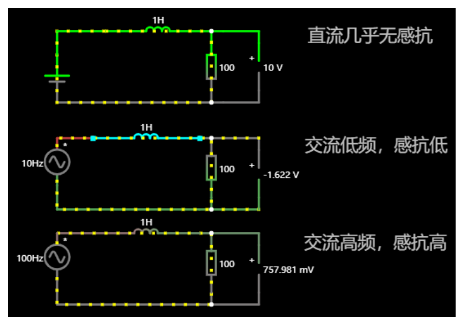

---

### 4.1 电感的参数

**电感主要关注：电感量、直流电阻、允许误差**

>**电感量：电感也具有储存能量（磁能）的作用，存储能力的大小称为感量，电感在电路中用L表示。电感的感量与线圈的面积，线圈的圈数，有无磁心有关**

>**直流电阻：直流电阻（DCR）是指电感器金属导体中固有的电阻，可以将其理解为与电感器串联的电阻器。通常要求直流电阻的阻值尽可能的小**

>**允许误差：允许偏差是指电感器上标称的电感量与实际电感的允许误差值。电感的允许误差的七个等级对应误差范围分别是：1、J允许误差为±5%；2、K允许误差为±10%；3、L允许误差为±15%；4、M允许误差为±20%；5、P允许误差为±25%；6、N允许误差为±30%；MIN允许误差为最小电感量**

---

### 4.2 常见电感

**常见的电感工艺有：磁环电感和贴片电感**

>**磁环电感**

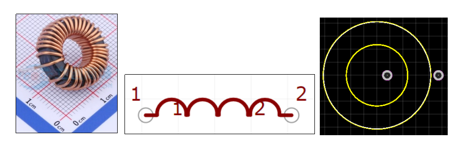

>**贴片电感**

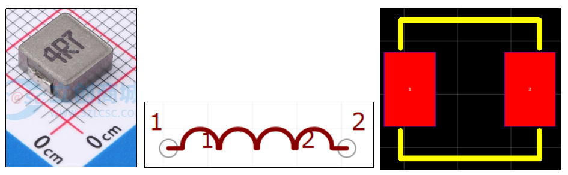

---

### 4.3 电感大小的识别

**电感量和允许误差采用三位数字和一位字母表示，前两位数字表示有效数字，第三位数字表示有效数字后几个0（倍乘数）**

>**例如：201K（前面两位数字20是有效数字，第三位数1表示后面有1个0；英文字母K表示误差为±10%），表示200uH±10%**

**数字和“R”、“N”混合标注，常用于小功率电感（如一些贴片电感），如用“R”表示小数点是，电感量的单位通常为uH。如用“N”表示小数点，单位通常为nH**

>**例如：4R7J（R表示小数点；英文字母J表示误差±5%），表示4.7uH ± 5%**

---

## 5.磁珠

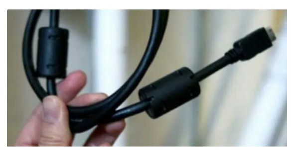

**磁珠可以理解成是一个感量比较小的电感，直流电阻几乎为0，它对100MHz以上的干扰信号具有一定的滤除作用**

>**为什么要使用磁珠？**

**空气中的电磁波会对我们的直流电线产生影响使得电线上产生交流的杂波，使用磁珠可以滤除这些高频的杂波**

>**电器符号及封装**

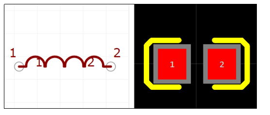

>**性能参数**

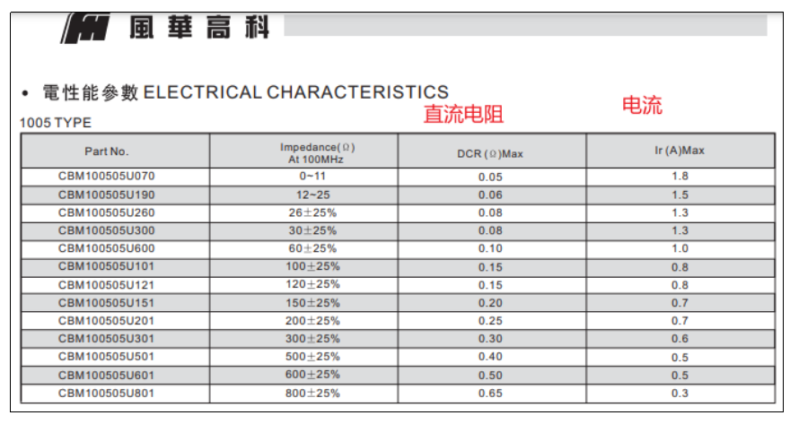

**磁珠的直流电阻值越大，对干扰信号的滤除作用就越好，同时通过的有效电流就越小，因此根据实际干扰信号的测量结果，选择合适阻值的磁珠**

---

## 6.继电器

**继电器是一种电控制器件，它实际上是用小电流去控制大电流运作的一种“自动开关”。常在电路中起着自动调节、安全保护、转换电路等作用**

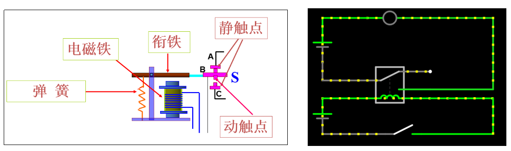

>**继电器的参数** 
>- **额定电压：指继电器线圈在正常工作状态下所能承受的最大电压值**
>- **最大切换电流：指继电器触点在额定电压下，通过继电器触点的最大负载电流**
>- **最大切换电压：指继电器触点可以在小于最大切换电压的情况下进行正常的开关操作**
>- **触点形式：常开、常闭和转换**

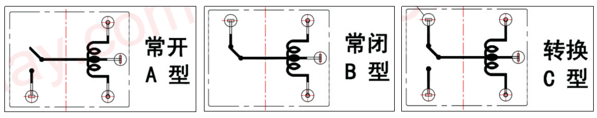

>**继电器 单刀双掷 5V**

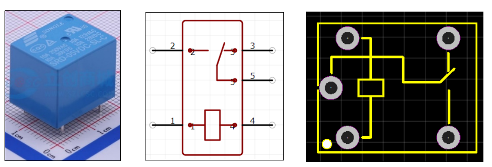

>**超小型中功率 12V 继电器 单刀刀掷-常开**

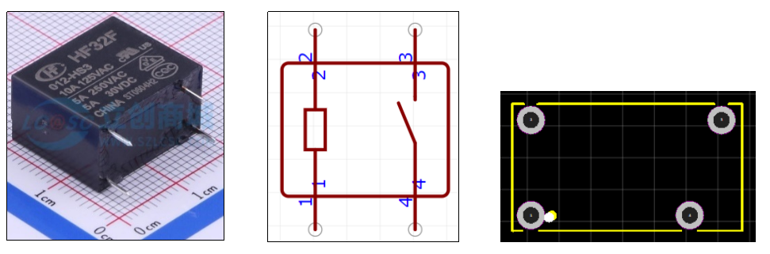

---

## 7.保险丝

**保险丝都可以看作一种特殊的电阻，它们的主要作用就是在电路中电流高于某一额定电流值时熔断，从而起到保护后续电路元器件的作用**

**保险丝又分为一次性保险丝和自恢复保险丝两种。通常一次性的保险丝，熔断过后要更换新的；自恢复保险丝在熔断过后可以复位，反复使用。保险丝仿真电路如下所示**

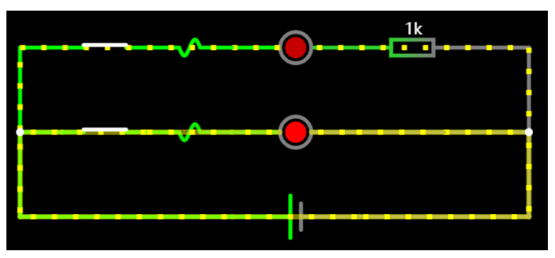

>**保险丝的参数**

- **保险丝的额定电压是从安全使用保险丝角度提出的，它是保险丝处于安全工作状态所安置的电路的最高工作电压**
- **保险丝的额定电流值通常有100mA、200mA、315mA、400mA、500mA、630mA、800mA、1A、1.6A、2A、2.5A、3A、4A、5A、6.3A等**
- **按熔断速度分，可分为：特慢速保险丝（一般用TT表示）、慢速保险丝（一般用T表示）、中速保险丝（一般用M表示）、快速保险丝（一般用F表示）、特快速保险丝（一般用FF表示）**

>**一次性保险丝**

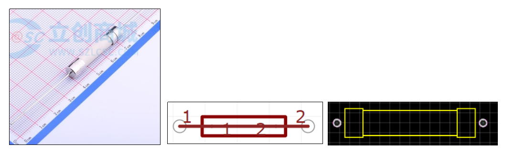

>**自恢复保险丝**

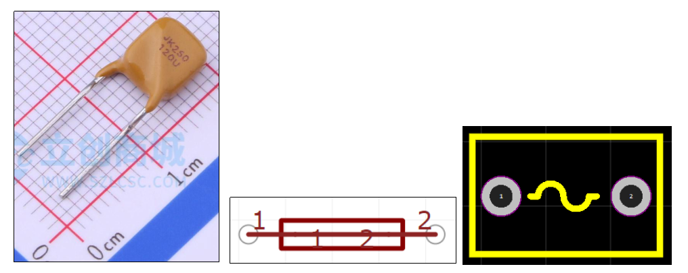

---

## 8.接插件

>**接插件的参数：常见的端子脚间距：1.25mm、1.5mm、2mm、2.54mm、3.5mm、3.81mm、3.96mm、5.08mm、7.62mm**

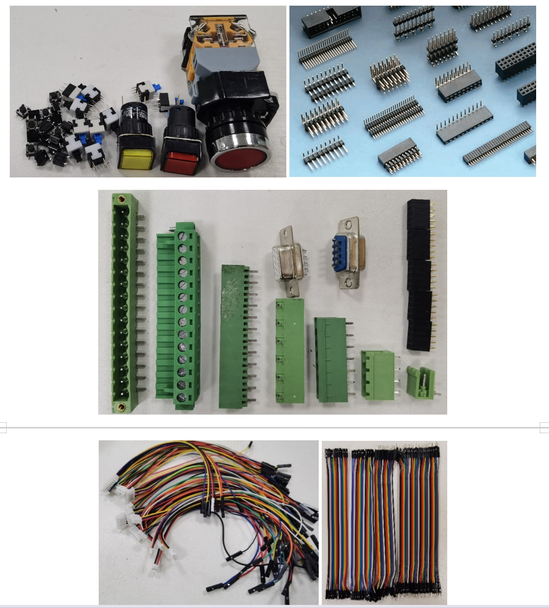

>**轻触按钮开关 尺寸：6*6.5**

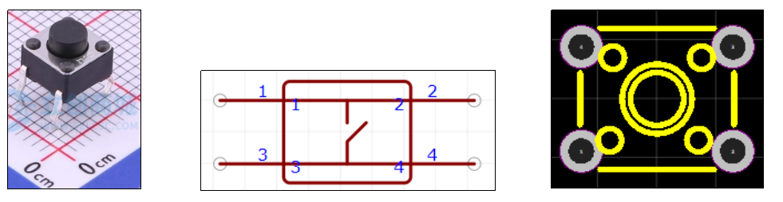

>**按钮开关7*7插件平头自锁**

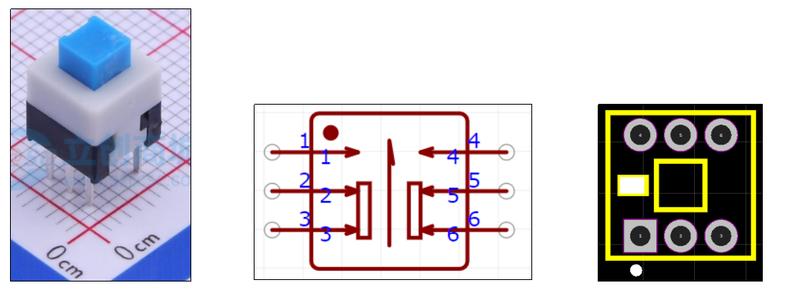

>**插件1*4P 间距：2.54mm**

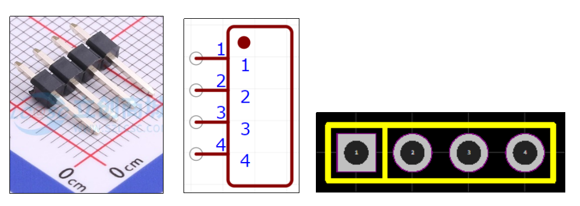

>**插件1*2P 间距：2.5mm**

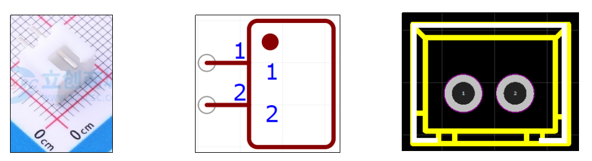

>**排母1*4P 间距：2.54mm**

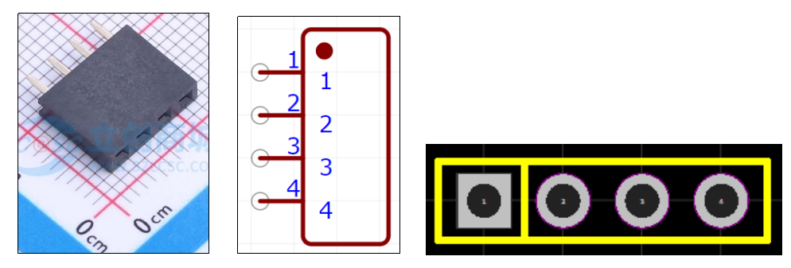

>**插座1*4P 间距：3.81mm**

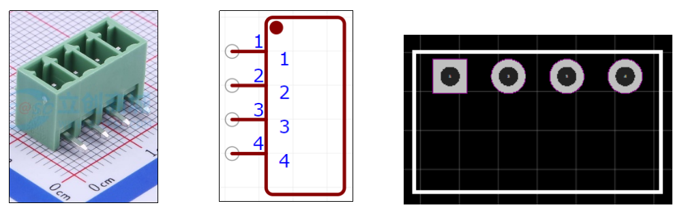

>**杜邦线 间距：2.54mm**

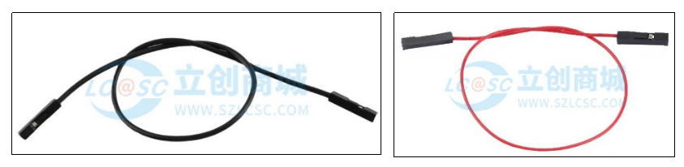

>**跳线帽**

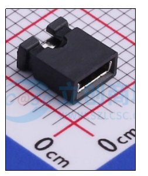

---

## 9.蜂鸣器

**能发出滴滴声音的元器件，在电子产品中主要用来发出警告音。比如：洗衣机操作按键的声音。烟感器发出的提示音灯**

**蜂鸣器按照驱动方式的不同，分为有源蜂鸣器和无源蜂鸣器。这里的源指的不是电源，而是音频振荡源**

**蜂鸣器内部结构图如下图所示，有线圈和铜圈，类似于电感**

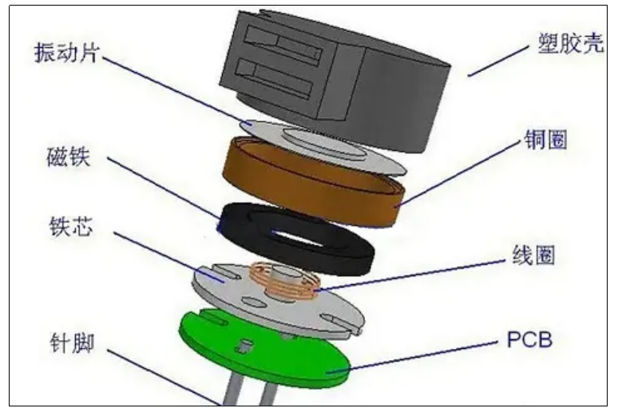

>**蜂鸣器的参数**

- **额定电压：指蜂鸣器可以正常工作的电压范围。超过额定电压会导致蜂鸣器声音过强或损坏，而低于额定电压则会导致蜂鸣器无法正常工作或声音过弱**
- **工作电压：指蜂鸣器可以发出声响的电压范围**
- **消耗电流（工作电流）：指蜂鸣器可以正常发出声响的电流范围**

>**有源蜂鸣器**

- **有源蜂鸣器内含驱动电路，也叫自激式蜂鸣器**

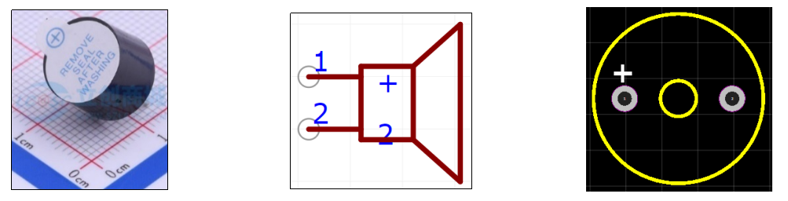

>**无缘蜂鸣器**

- **无源式蜂鸣器：需要外部加一个震荡电路才能发出声音，也叫它激式蜂鸣器**

>**无源蜂鸣器的典型电路：因为蜂鸣器在电路中一般是由单片机的IO端口驱动的，但单片机的IO端口不足以驱动蜂鸣器，所以，一般要配合三级管或MOS管来驱动蜂鸣器**

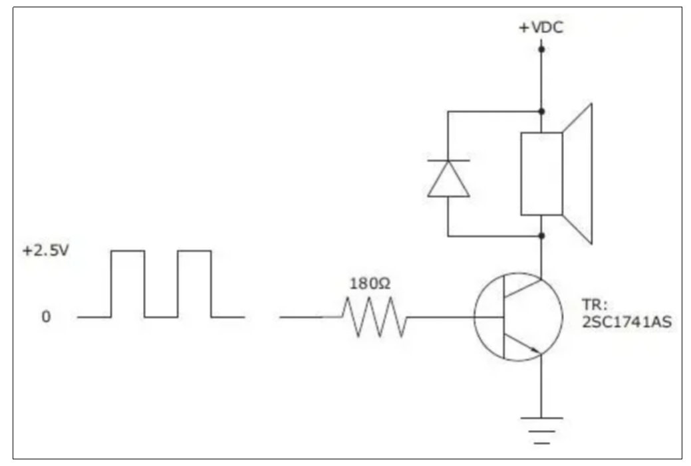

>**如何区分是有缘蜂鸣器还是无缘蜂鸣器？万用表测试有无电阻**

**把万用表调到欧姆档位，如果电阻数值有显示则是无源蜂鸣器，如果没有数值显示则是有源蜂鸣器**

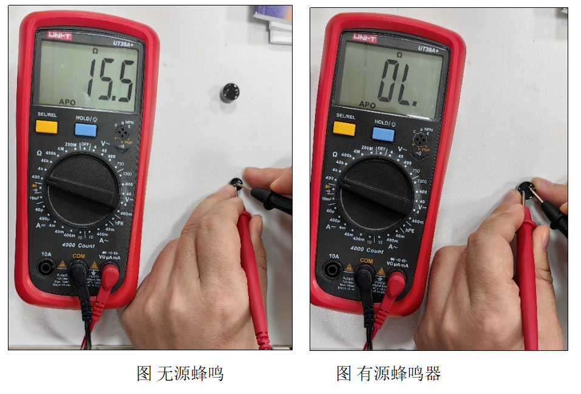

---

## 10.晶振(XTAL)

**晶体振荡器简称晶振，电路中用X或Y表示，它是一种由石英晶体或陶瓷的压电作用引起的高频率振动的电子器件。晶振能产生一个周期非常稳定的正弦波信号，在数字电路中，晶振的作用是为单片机提供时钟脉冲信号**

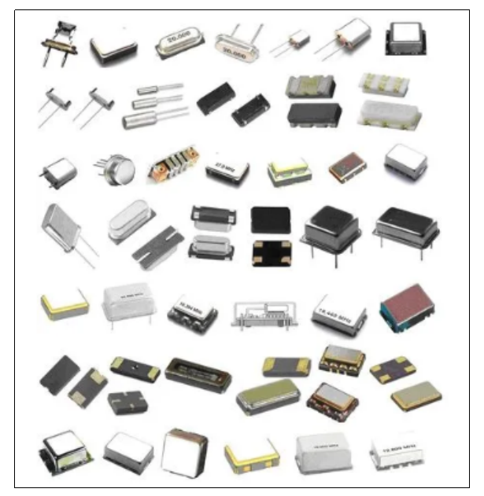

>**晶振的符号**

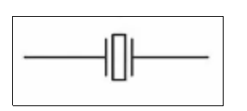

>**晶振重要参数**

**晶振稳定度：指的是晶振出厂的误差，单位是PPM，例如：100PPM指误差不超过百万分之100**

**负载电容：晶振工作时在引脚处会接电容。一般来说负载电容的大小不超过100PF**

---

## 11.电池

**电池以化学能形式放电，电压会随着放电降低**

>**电池的参数**

- **额定电压是指电池设计和生产过程中确定的标准电压值，通常以伏特（V）为单位**
- **电池容量是指电池存储电量的大小。单位是mAh，中文名称是毫安时。（例如电池容量200mAh，表示在额定电压情况下，电池可以提供200mA恒流的持续时间为1小时）**

>**电池的分类**

**电池按照充电次数，可以分为：不可充电电池和可以反复充电的电池**

>**不可充电电池：给单片机时钟芯片供电，当单片机没有通电时仍然能够保持时间日期不变**

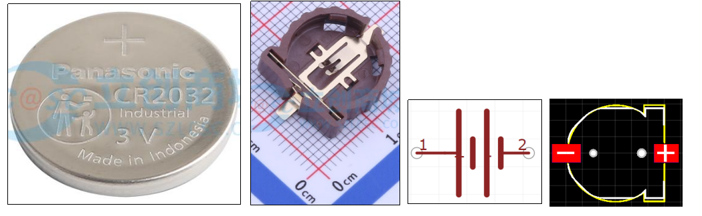

>**可反复充电电池**

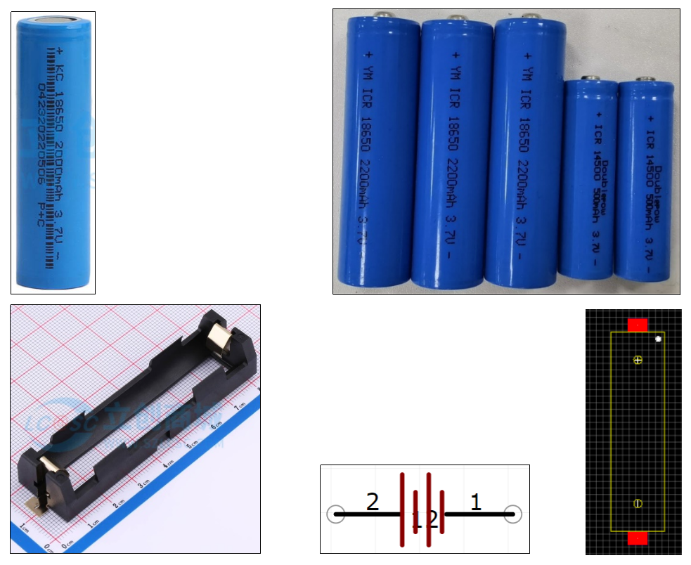

>**名称说明**

**18650：18表示直径为18mm，65表示长度为65mm，0表示为圆柱形电池**

**14500：14表示直径为14mm，50表示长度为50mm，0表示为圆柱形电池**

---

## 12.稳压电源芯片

**稳压电源芯片又称为电源管理芯片，是一种专门用来控制输出电压稳定的电子芯片，它能够将不稳定的电源电压，通过内部的反馈控制电路，转换为稳定的输出电压。常见的输出电压：5V、3.3V**

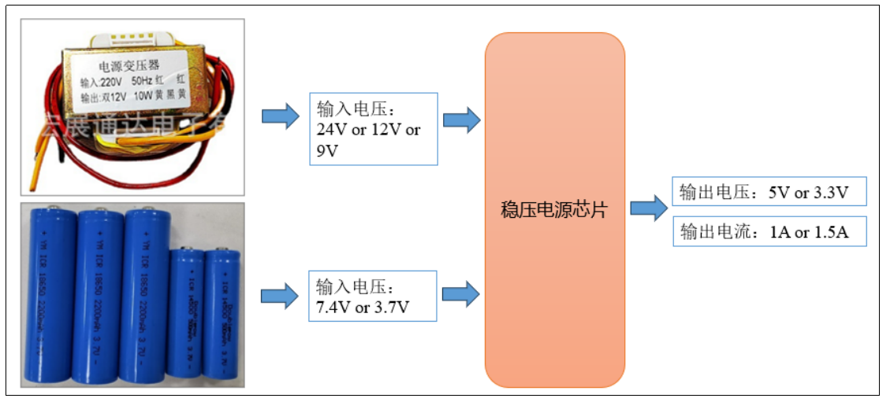

>**稳压电源的参数**

- **输入电压：稳压电源芯片在输入端接电压输入范围**
- **输出电压：稳压电源芯片在输出端保持的电压**
- **输出电流：芯片能够提供的最大输出电流值**

>**7805稳压电源芯片**

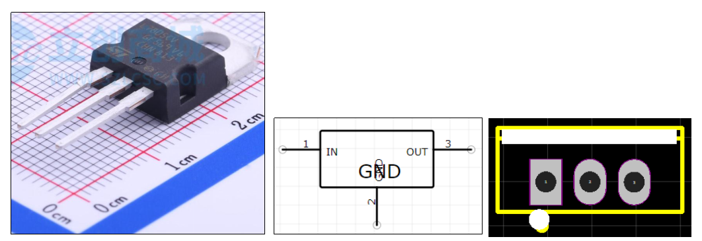

**7805经典电路**

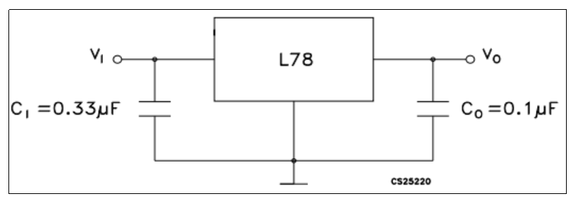

>**AMS1117-3.3 稳压电源芯片**

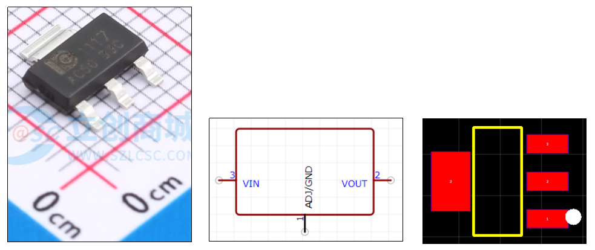

**AMS1117-3.3 经典电路**

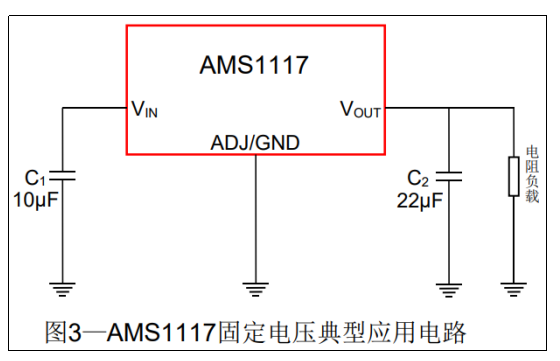

>**散热片**

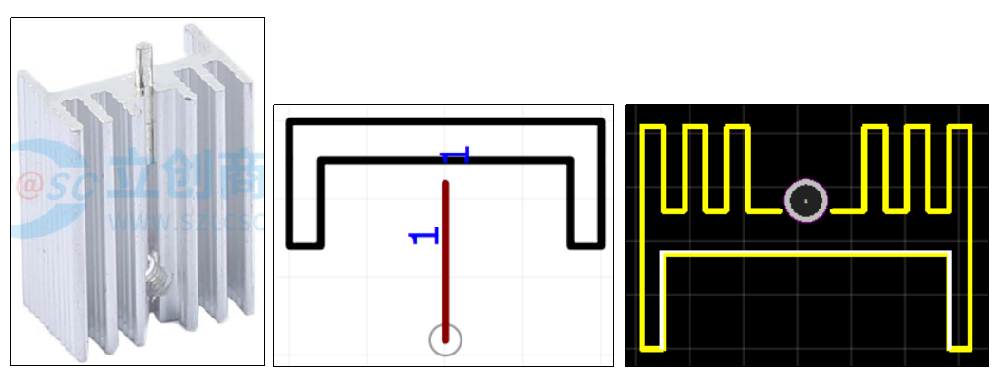

---

## 13.万用表

**万用表，常简称为"多用表"，是一种电子测量仪器，用于测量直流电流、直流电压、交流电流、交流电压、电阻等多种电气参数。由于其广泛的测量功能和便携性，万用表在电子、电气和通信领域都是一个常见且必不可少的工具**

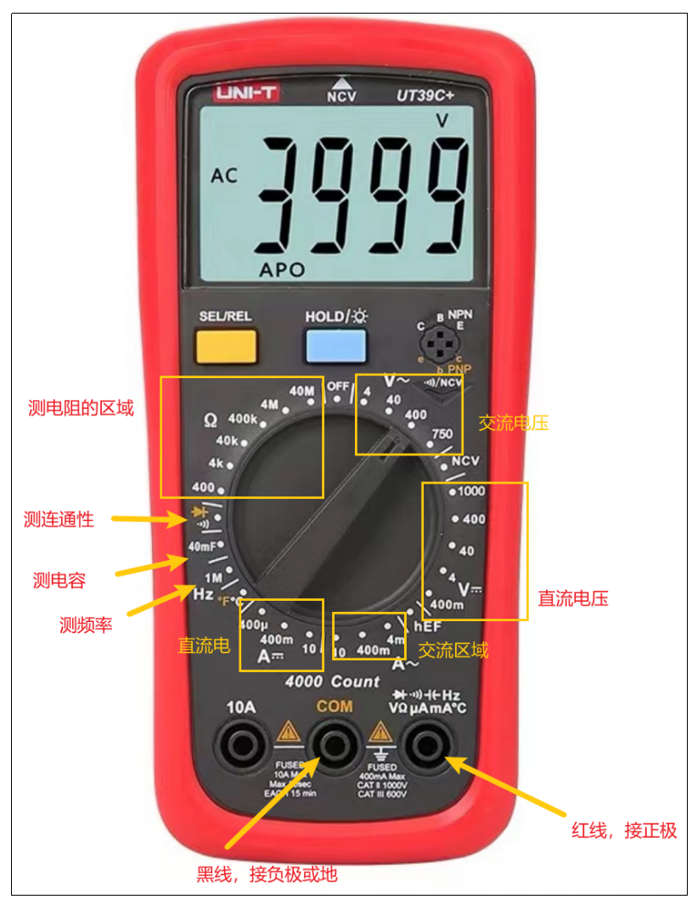

>**安全说明及注意事项**

- 后盖没有盖好前严禁使用，否则有电击危险
- 使用前应检查并确认仪表和表笔绝缘层完好，无破损及断线
- 在使用仪表时，用户的手指必须放在表笔手指保护之后
- 被测直流电压高于60V或交流电压高于30Vrms的场合，应小心谨慎，防止触电
- 被测信号不允许超过规定的极限值，以防损坏仪表
- 严禁在测量中拨动量程开关更改量程档位，以防损坏仪表

>**电气符号**

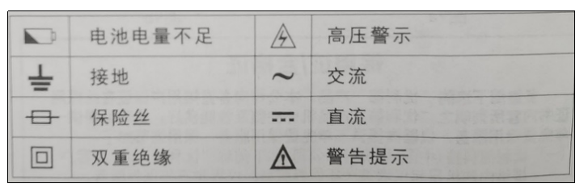

>**直流电压与交流电压测量**

- 将功能量程开关拨到交流电压档位上
- 将红笔插入“VΩmA”插孔，黑表笔插入“com”插孔，并将两只表笔笔尖分别接触所测电压的两端（并联到负载上）进行测量
- 从显示屏上读取测试结果

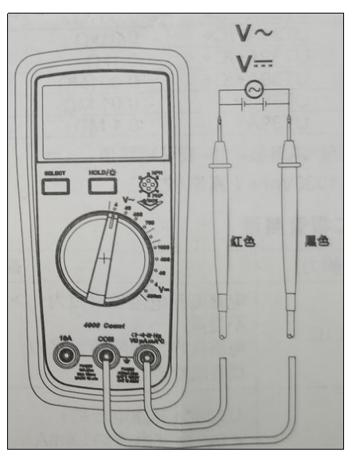

>**电阻测量**

- 将功能量程开关拨到电阻测量档位上
- 将红表笔插入“VΩmA”插孔，黑表笔插入“com”插孔，并将两只表笔笔尖分别接触所测电阻的两端（与被测电阻并联）进行测量
- 从显示屏上读取测试结果

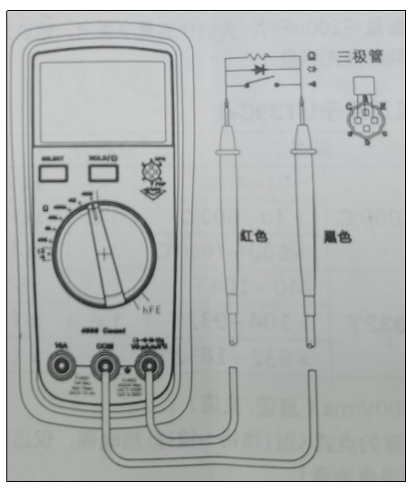

>**电路通断测量**

- 将功能量程开关拨到电路通断测量档位上
- 将红表笔插入“VΩmA” 插孔，黑表笔插入“com”插孔，并将两只表笔笔尖分别接触被测量的两个断点进行测量
- 如果被测两个端点之间电阻>51Ω，认为电路断路，蜂鸣器无声；被测两个端点之间电阻<=10Ω，则认为电路导通性良好，蜂鸣器连续蜂鸣，发声的同时，并伴有红色LED发光指示

>**二极管测量**

- 将功能量程开关拨到二极管测量档位上。（按黄色的SEL/REL切换通断测量和二极管测量）
- 将红表笔插入“VΩmA” 插孔，黑表笔插入“com”插孔，并将两只表笔笔尖分别接触PN结的两个端点
- 如果被测二极管开路或极性反接时，将会显示“0L”。对硅PN结而言，一般约为500~800mV（0.5~0.8V）确认为正常值

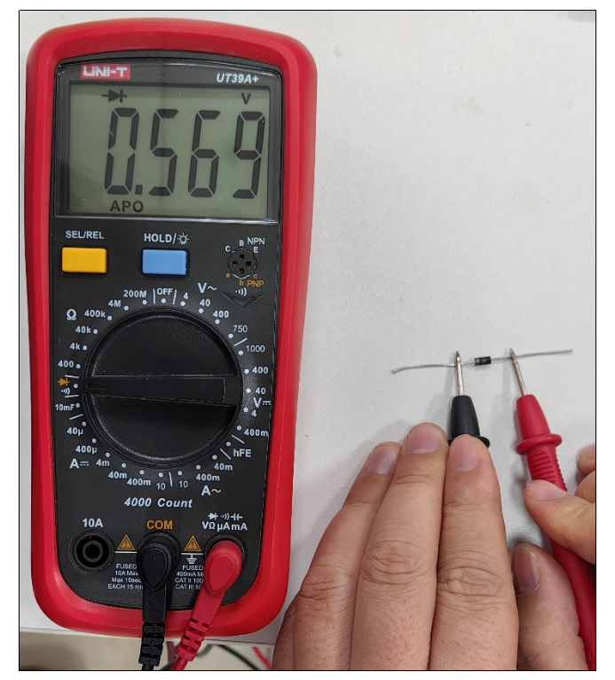

> **电容容量的测量**

- 将功能量程开关拨到电容测量档位上
- 将红表笔插入“VΩmA” 插孔，黑表笔插入“com”插孔，将两只表笔笔尖分别接触测电容的两个端点
- 从显示屏上读取测试结果。在无输入时仪表会显示一个固定读数，此数为仪表内部固有的电容值。对于小容量电容的测量，被测量值一定要减去此值，才能确保测量精度。为此小容量电容的测量请使用相对测量功能（REL）测量（仪表将自动减去内部固定值，方便测量读数）

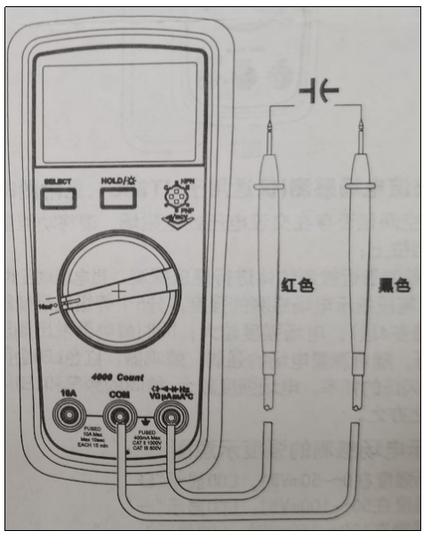

>**直流电流与交流电流测量**

- 将功能量程开关拨到直流（交流）电流档位上
- 将红表笔插入“VΩmA” 插孔或10A插孔，黑表笔插入“com”插孔，并将表笔串联到待测量的电源或者电路中
- 从显示屏上读取测试结果

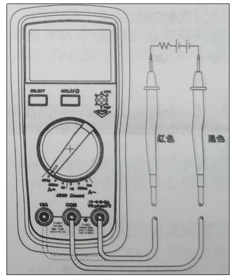