# 第三章：模拟电路基础

## 1.模拟电路概述

**信号是反映信息的物理量，用电流作为载体的信号，方便的储存和传递。电信号分为模拟信号和数字信号，模拟信号是连续的，数字信号是离散的。模拟电路就是用来管理和传递模拟信号的电路，涉及对于模拟信号的滤波，放大和传递，除了用到我们上面讲过的一些器件，还要用到一些其他核心元件，例如二极管、晶体管、场效应管等**

**在嵌入式软件开发中，有关模拟电路的部分，主要是用晶体管和场效应管做开关电路（继电器其封装体积较大，不适合用在集成电路里），至于信号的放大，滤波等是嵌入式硬件工程师的事情**

---

## 2.半导体器件基础原理

### 2.1 二极管

>**二极管单向导通原理**

**二极管实际就是一个PN结，当电流正向通过时，压降非常小；当电流反相通过时，如果不超过反向电压，几乎是截止状态。二极管伏安特性曲线如下图所示：**

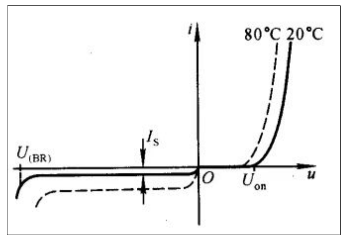

>**二极管导通原理总结**

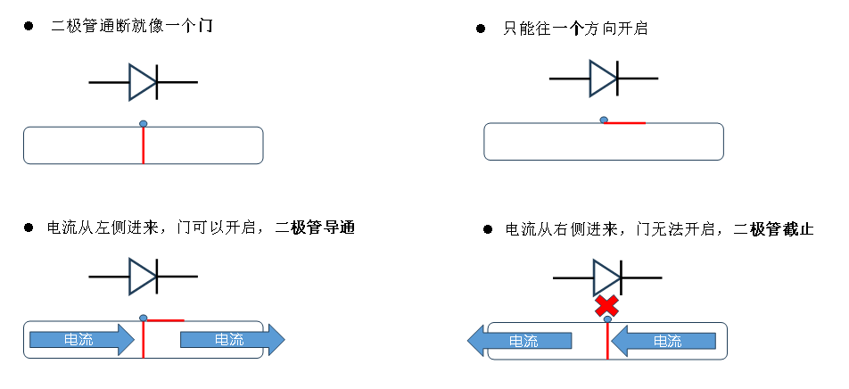

>**发光二极管**

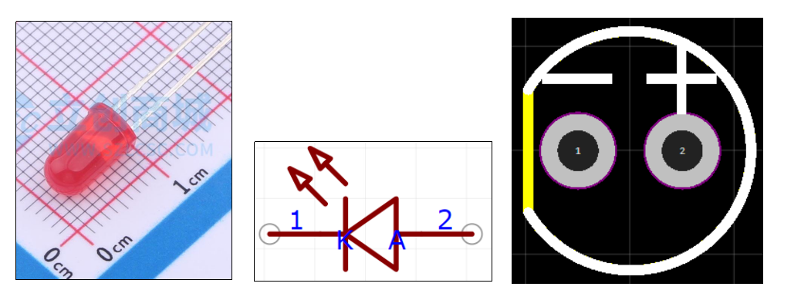

>**数码管 4位 0.36英寸红色 共阴极**

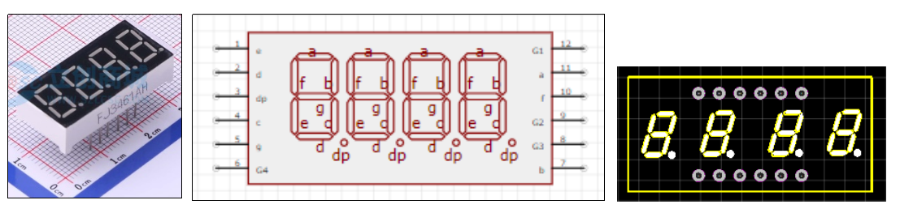

**数码管内部原理图：**

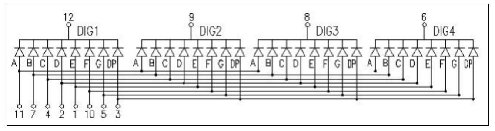

>**8*8点阵 共阴LED**

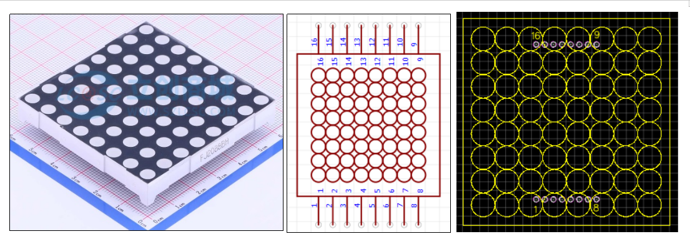

**点阵LED内部原理图：**

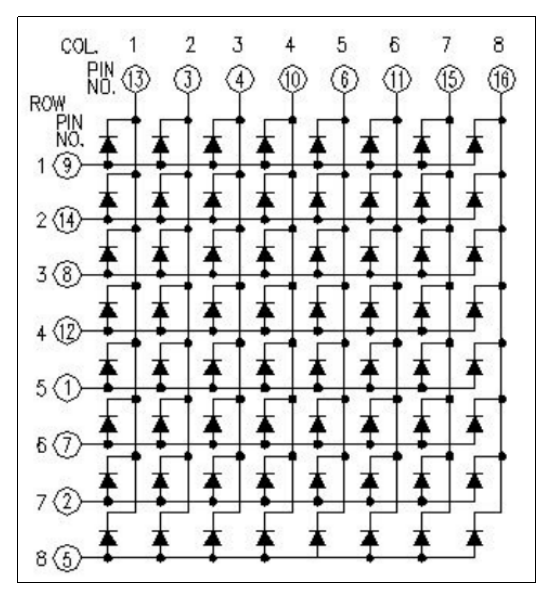

---

### 2.2 稳压二极管

**稳压二极管又叫齐纳（Zener）二极管，利用当PN结反向击穿时两端电压保持不变的特性设计而成。一般用在稳压电路中。稳压二极管正向使用时相当于普通二极管，稳压功能需要反向使用。稳压二极管反向耐压一般较低，所以不能将其代替普通二极管使用**

>**稳压二极管符号**

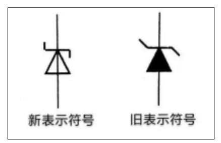

**为什么稳压二极管能够稳压？二极管的击穿分三种状态：雪崩击穿、齐纳击穿、热击穿（损坏），雪崩击穿持续时间比较长就会热击穿。齐纳击穿是二极管可以持续工作的一种状态，不会损坏**

>**稳压二极管伏安特性曲线**

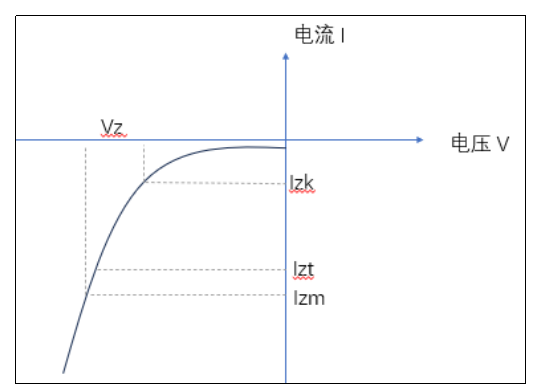

>**稳压二极管重要参数，以1N4733A为例**

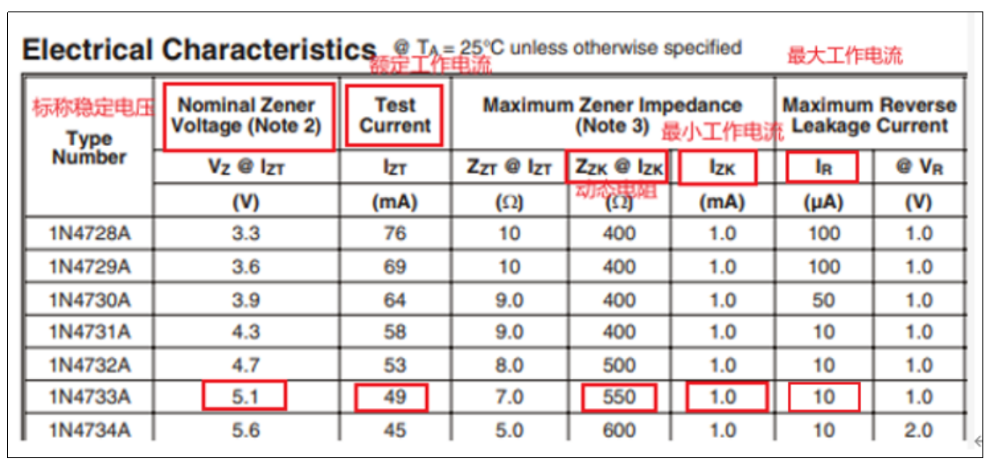

- **标称稳定电压：5.1V**
- **额定工作电流：49mA**
- **最小工作电流：1mA**
- **动态电阻：550Ω**
- **最大工作电流：10μA**

>**稳压二极管应用电路**

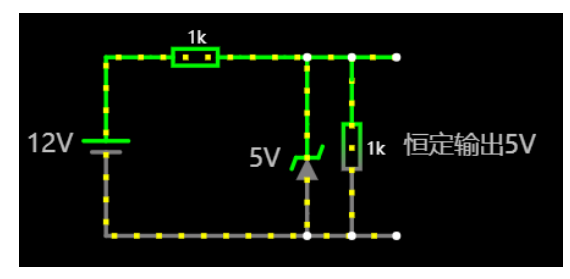

---

### 2.3 晶体管(三极管)

**晶体管，又名三极管，其实就是连续的两个PN结接在一起，有NPN和PNP两种结构**

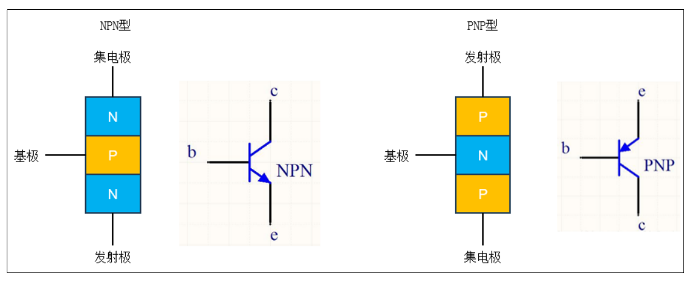

**我们以NPN型为例，讲解一下三极管导通的原理:**

**（1）NPN型三极管**

>**开关导通基本原理**

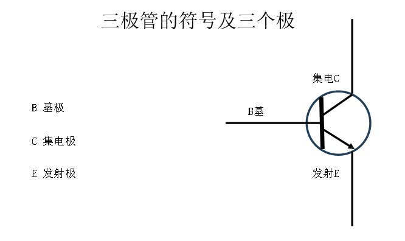

**三极管的这种特性，可以作为开关电路的控制端使用，例如：**

- **NPN型三极管：如果我们给B极一个5V信号，LED通路就通了，此时晶体管起到了类似继电器的作用**

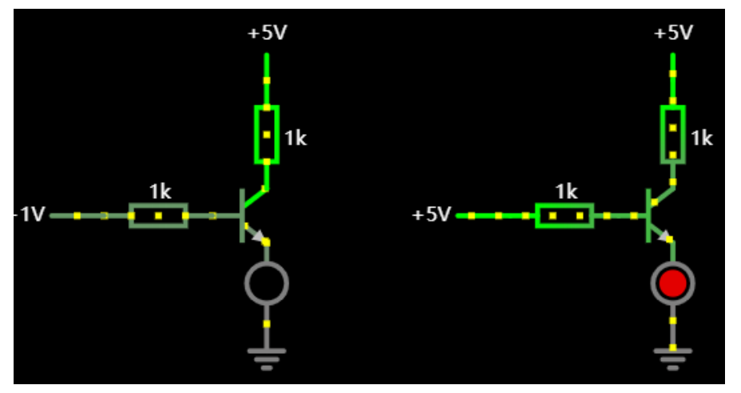

- **PNP型三极管：如果我们给B极一个低信号，LED通路就通了**

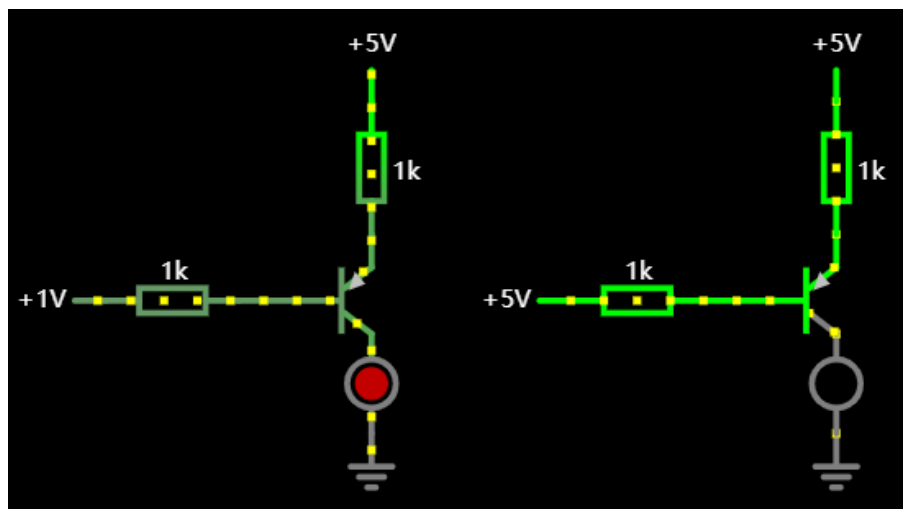

**（2）三极管放大的基本原理**

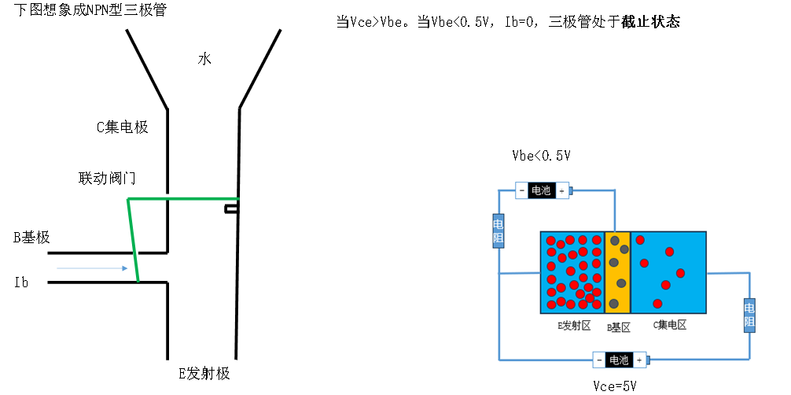

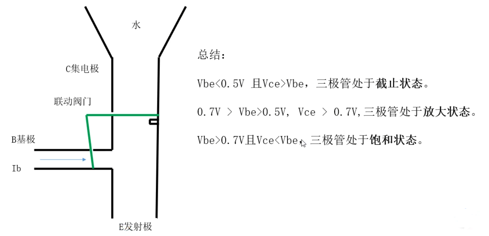

**（3）三极管 NPN 8050**

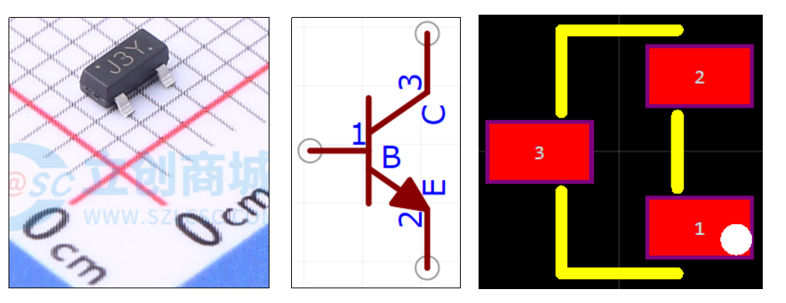

---

### 2.4 场效应管(MOS管)

**MOS管 英文全称：Metal Oxide Semiconductor Field Effect Transistor**

**场效应管(MOS管)也是一种晶体管，它通过电场来控制电流。传统的晶体三极管通过电流来控制电流。场效应管有许多应用，包括放大、开关和电压控制等。场效应管是芯片的底层原理，是芯片中的最小单位**

>**场效应管分类**

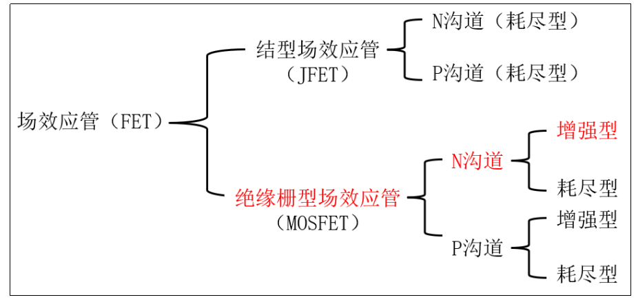

>**绝缘栅型场效应管N沟道增强型，开关的基本原理**

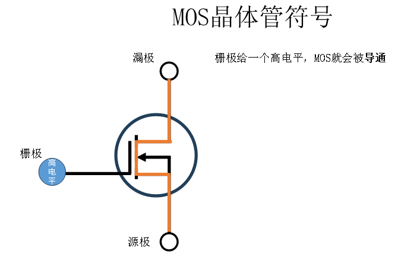

**绝缘栅型场效应管增强型对应N沟道和P沟道的符号如下图所示:**

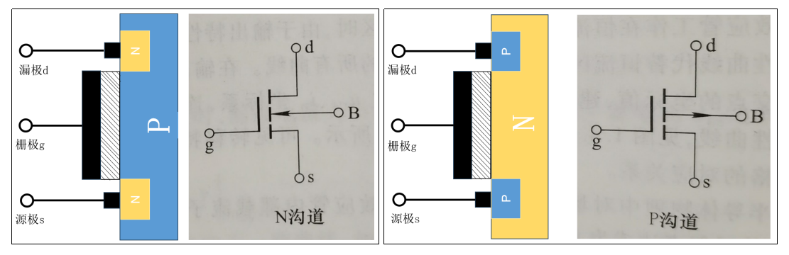

**NPN型增强场效应管：如果我们给g极一个5V信号，LED通路就通了，说明场效应管开启。如果给g极一个1V信号，LED灯灭，说明场效应管关闭**

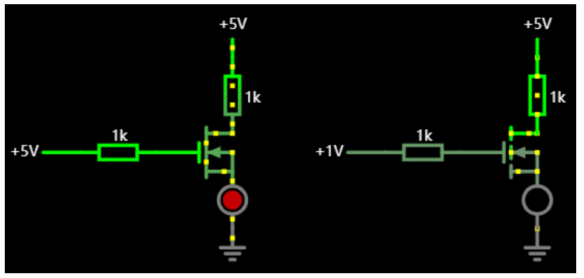

**PNP型增强场效应管：如果我们给g极一个1V信号，LED通路就通了，说明场效应管开启。如果给g极一个5V信号，LED灯灭，说明场效应管关闭**

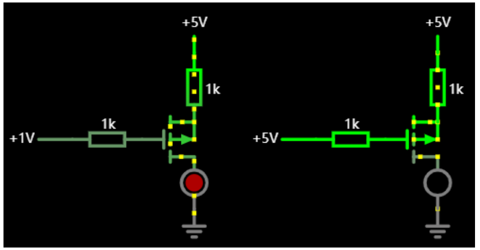

>**增强型场效应管N沟道**

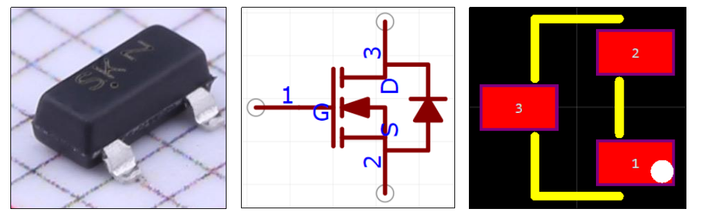

---

### 2.5 案例：光感灯

**我们来实现一个根据光照的强弱来控制灯泡的亮暗电路**

**电位器和光感电阻构成分压电路。当光照强度减少，光感电阻阻值增加，三极管基极电压增加，三极管导通，LED灯发光。当光照强度增加，光感电阻阻值减少，三级管基极电压降低，三极管关闭，LED灯灭掉**

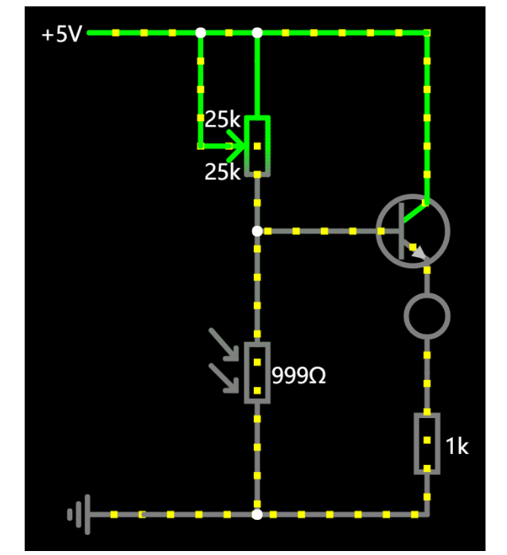
