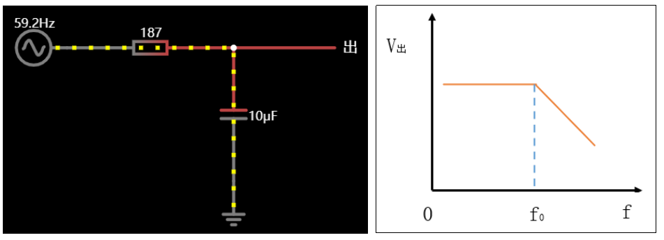

# 第四章：典型电路实践

## 1.电阻

### 1.1 压敏电阻

**压敏电阻是一种限压型保护器件。利用压敏电阻的非线性特性，当过电压出现在压敏电阻的两极间，压敏电阻可以将电压钳位到一个相对固定的电压值，从而实现对后级电路的保护。简言之，压敏电阻常作为电路中的过压保护器件，用来吸收电路中的尖峰电压**

>**主要参数：压敏电压、最大连续电压、最大限制电压、最大冲击电流、响应时间**

>**工作原理：当加在压敏电阻上电压低于阈值（压敏电压），相当于一个无穷大的电阻，等同于一个断开的开关。当加在压敏电阻上的电压高于阈值（压敏电压），相当于一个极小的电阻，等同于一个闭合的开关**

>**压敏电阻的伏安特性曲线**

>**电路应用：一般并联在电路两端，与保险丝配合使用，保护后级电路**

---

### 1.2 上拉电阻

**概念：上拉和下拉电阻统称为拉电阻。在电子元器件中并不存在上拉电阻和下拉电阻这两种实体的电阻。之所以这样称呼是根据电阻使用的场景不同来具体定义的。其本质还是电阻。上拉电阻是指通过电阻与一个固定的高电平Vcc相接，使其电压在空闲状态保持在Vcc电平，此时电阻被称为上拉电阻。同理，下拉电阻是指将某信号线通过电阻接在固定的低电平GND上，使其空闲状态保持GND电平，此时的电阻被称为下拉电阻**
  
**最常见的用法：将不确定信号钳位在高电平（上电保持状态）**
  
**原理：**

---

### 1.3 下拉电阻

**下拉电阻：接在引脚和地之间的电阻**

**下拉电阻作用：将一个不确定的信号钳位在低电平**

---

### 1.4 限流电阻

**限流电阻作用：将电流大小限制到元器件的正常工作电流**

**阻值的确定：**

- **基本参数：压降、工作电流或功率**
- **公式：电流=功率/压降**

**重要参数**

**如果亮度要求不高，也可以降低电流，延长led灯的使用寿命，比如：让led在2V、10mA的情况下工作：**

---

### 1.5 零欧姆电阻

**零欧姆电阻又称为跨接电阻器，是一种特殊用途的电阻，0欧姆电阻器并非真正的阻值为零，欧姆电阻实际是电阻值很小的电阻。正因为有阻值，也就和常规贴片电阻一样有误差精度这个指标**

>**零欧姆电阻的使用场景**

- **0欧姆电阻实际是电阻值很小的电阻，想测某部分电路的耗电流的时候，接0欧姆电阻，接上电流表，这样方便测耗电流，可用于测量大电流**

- **在单面板布线时，如果实在布不过去了，也可以加一个0欧的电阻**

---

## 2.电容

### 2.1 滤波

**（1）电容滤波的应用**

**单片机上电的瞬间到稳定供电，会产生很多杂波，利用电容隔直通交的特性，可以将杂波过滤掉**

**（2）低通滤波（f0=1/2πRC）**

**说明：输入的信号频率超过f0的频率，就会被电容通路吸收走，只有低于f0频率的信号才能正常输出出去**

**（3）高通滤波（f0=1/2πRC）**

**说明：输入的信号频率高于f0的频率，能在输出端获取到完整的输入信号。如果输入信号频率低于f0的频率，输出端不能获取完整的输入信号**

---

### 2.2 耦合电容

>**什么是耦合：就是两个电路之间的连接**

>**原理：利用电容隔直通交的特性，保留电路中想要传输的高频信号，去除直流信号**

>**电路2需要一个方波 信号（交流信号），通过电容去除掉直流信号**

---

### 2.3 旁路电容

>**旁路电容：利用电容通交隔直的特性，滤除电路中的高频信号**

