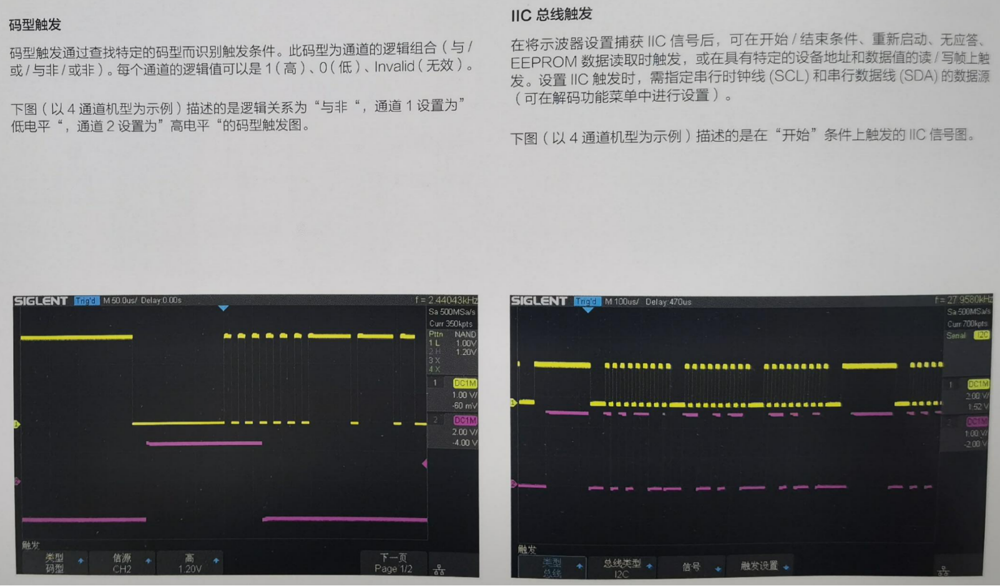
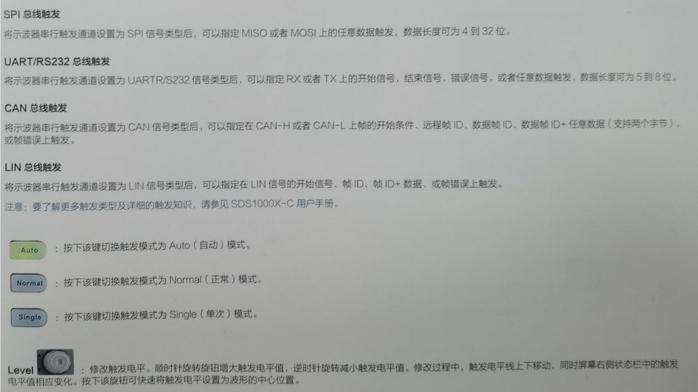

# 第五章：电气符号与工具使用

## 1.常用电气符号

---

## 2.稳压电源使用

**HY3005B可调式直流稳压稳流电源采用先进的单片机技术，结合高品质编码开关实现输出电压与输出电流均连续可调、且稳压与稳流自动转换的高稳定性直流电源。粗调与细调可按需一键切换，可分别对电压步进1V与步进10mV精确调整；对电流步进100mA与步进1mA精确调整**

**（1）技术参数**

- **输入电压：104~127V AC （60HZ），或207~253VAC（50HZ）**
- **额定输出电压：0-30V**
- **额定输出电流：0-5A**

**（2）使用**

- **①电源开关**
- **②交流电输入插座（含保险丝）**
- **③隐藏的保险丝盒**
- **④输出电压调节旋钮：任意设定稳压值，轻按旋钮可切粗调（步进1V）与细调（10mV）模式**
- **⑤输出电流调节旋钮：任意设定限流值，轻按旋钮可切换粗调（步进100mA）与细调（步进1mA）模式**
- **⑥输出开关：电压电流设定完成后，按此键控制输出的接通和关断**
- **⑦输出接线柱正极（+）红色**
- **⑧机壳接地接线柱（GND）绿色**
- **⑨输出接线柱负极（-）黑色**
- **⑩LED显示说明：4位数字电压电流显示，（CV）灯指示恒压状态；（CC）灯指示恒流状态；（OUTPUT）灯指示输出关断状态**
- **锁定功能：同时按住旋钮④&⑤约三秒钟，显示屏闪烁一次，输出设定值即被锁定，锁定状态不受断电影响**
- **解锁：锁定状态下，同时按住旋钮④&⑤约三秒钟，显示屏闪烁一次，输出设定值被锁定状态即被解除**

---

## 3.示波器使用（说明手册）

