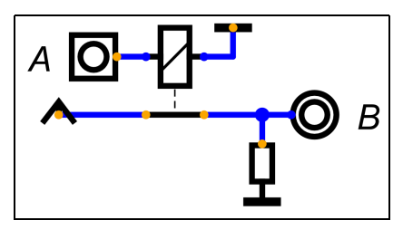

# 第一章：数字电路基础

## 1.二进制数据表达

**二进制是一种数字表示法，它使用两个不同的数字符号，0和1，来表示数值**

- **位(bit)：不同于十进制中，每个位可以用0-9表示，二进制中每位都是0或1，每个二进制位我们称之为一个bit，可以表示两种状态。位一般用b代替，例如8b代表8个bit**
- **字节(byte)：8bit组成一个字节，总共可以表示256种状态。字节一般用B代替，例如8B一般表示8个字节**
- **K：表示2的十次方，例如，1KB就是1024B**
- **M：表示2的20次方。例如：1MB就是1048576B**
- **G：表示2的30次方**
- **T：表示2的40次方**

**二进制是计算机科学的基础，现实中的绝大部分信息都可以完全数字化，并进一步用二进制来表示和存储**

---

### 1.1 用二进制表示文字

**二进制表示文字的方法：主要用GBK和UTF-8**
- **ASCII码(1字节)：8bit表示一个字符，不同编码对应ASCII表来表示文字和符号**
- **GB2312(2字节)：16bit表示一个字符，涵盖了大量中文字符**
- **GBK(2字节)：相比于GB2312加入了繁体**
- **GB18030(1~4字节)：1-4字节动态长度编码，加入中文外的语言字符**
- **UTF-8(最常用)：使用1~4个字节表示一个字符。UTF-8兼容ASCII，但不兼容UTF-16和UTF-32**
- **UTF-16：使用2或4字节表示一个字符**
- **UTF-32：使用4字节表示一个字符**

---

### 1.2 用二进制表示图片
**二进制表示图片的方法：图片像素化、像素数字化**

- **图片像素化：现实中的图片是连续的，但如果想用数字表示图像，就需要将一张完整的图像，横纵向分别切成很多份，从而拆成一个一个像素点，每个像素点是一个色块，而横纵切分的份数，我们称之为分辨率。例如，我们将一张4比3比例的图像，横向拆成800份，纵向拆成600份，那么我们就将一个图像拆成了480000个像素，而这张图像的分辨率为800x600。由此可见，图像的分辨率越高，图像就越清晰**
- **像素数字化：每个像素就是一个颜色块。具体的颜色，可以用红绿蓝三原色调配成。而每种原色，就可以用一个数字表示其深浅。例如，我们用一个字节（0-255）表示一种颜色的深浅，那么一个像素点就可以用三个字节表示。颜色的深浅是连续的，用0-255这种级别如果不够精确，我们可以选择用两个字节表示一个颜色（0-65535）。像素的深浅级别我们称为“位深”，例如0-255为8位深，0-65535是16位深。位深越大，颜色切分越连续，越不容易出现色阶。现今网络上的图像一般都是32位深**

---

### 1.3 用二进制表示声音

**二进制表示声音的方法：采样、量化**

- **采样：声音来自于物体的振动，是一种连续的波形。我们如果想用数字表达声音，还是要将其离散化。首先我们将一段时间（例如1秒钟）的连续声波分成很多份，并将每一份记录一个平均振幅。拆分的份数，我们称之为采样率。拆分过程中必然会产生信息丢失，而采样率越大，信息丢失越少。目前比较常用的采样率是44100HZ或者48000HZ**
- **量化：每个采样我们还要用一个数字表示它的高度（振幅），这又是一个连续量离散化的过程，跟图像的颜色深浅类似，我们也可以用0-255或者0-65535表示振幅的高度。这个数字的取值范围叫做声音的位深。目前通用的位深一般是16bit或者24bit**

---

### 1.4 用二进制表示视频

**视频就是连续的图片和声音。当然，如果只是将图片拼接到一起，那么视频的体积会非常大。实际上视频是通过一种有损压缩将很多图片压缩在一起。目前比较流行的视频编码标准为H.264、H.265、AV1**

---

## 2.数字电路

**将信息数字化后，我们可以方便的用二进制表示信息。而现代计算机技术的基础——数字电路，研究的就是如何用电表示二进制**

---

### 2.1 数字电路仿真软件：Digtal

**官方网站：https://github.com/hneemann/Digital**

**注意：Digtal需要java环境**

---

### 2.2 基础逻辑门电路

**基础逻辑电路重点掌握表述该逻辑的四种方式：逻辑表达式、真值表、逻辑符号、口诀**

**(1)非门：取反(输入与输出相反)**
- **①从“组件——输入输出”中，选择一个输入和一个输出**
- **②从“组件——导线”中选择一个地、一个电源和一个下拉电阻**
- **③从“组件——开关”中选择一个继电器**
- **④右键点击输入，标签输入A**
- **⑤右键点击输出，标签输入B**
- **⑥右键点击继电器，勾选“闭合继电器”**

**按照如下电路图连接：**

**(2)与门：同真为真(有0出0，全1出1)**
- **①从“组件——输入输出”中，选择两个输入和一个输出**
- **②从“组件——导线”中选择两个地、一个电源和一个下拉电阻**
- **③从“组件——开关”中选择两个继电器**

**(3)或门：同假为假(有1出1，全0出0)**
- **①从“组件——输入输出”中，选择两个个输入和一个输出**
- **②从“组件——导线”中选择两个地、一个电源和一个下拉电阻**
- **③从“组件——开关”中选择两个继电器**

---

### 2.3 其他门电路

**与或非三门我们一般称之为基础门电路，而其他门电路可以用这三种门电路组合得到**

**(1)异或门：相同为假(相同出0，相异出1)**

**真值表和电路图：**

**(2)与非门：同真为假(全1出0，其他出1，与门结果取反)**

**真值表和电路图：**

**(3)或非门：同假为真(有1出0，全0出1，或门结果取反)**

**真值表和电路图：**

**(4)异或非门：相同为真(相同出1，相异出0，异或门结果取反)**

**(5)逻辑门电路总结：**

---

### 2.4 运算器

**(1)半加器：**

**(2)加法器：**

**半加器实现了一位全加器，只能处理两个数的运算，但在实际计算中，如果我们做加法的两个位不是最低的位，那就要考虑低位可能产生的进位。也就是说，一个功能完整的1位加法器，应该考虑三个输入，除了A、B两个加数，还要考虑是否存在低位进位Cin**

**(3)4位加法器：多位加法器就是多个加法器的串联，下面我们以4位加法器为例来展示多位加法器电路**

- **添加输入Cin，A，B，右键点击A和B，将位数调整为4**
- **添加两个“组件——导线”中的分裂器，右键点击将其设置如下图所示**
- **将分裂器输入端与A、B相连，并添加8个“组件——导线”里面的隧道，分别命名为A0、A1、A2、A2、B0、B1、B2、B3，并接在分裂器的输出端，如图示**

- **添加输出S，并将位数调整为4，并添加分裂器，输入/输出设置为1，1，1，1/4，并将输出端连接到S，输出端连接四个隧道S0、S1、S2、S3，如图示：**

---

### 2.5 锁存器和触发器

**上面提到的很多计算电路都有一个特点，当输入信号发生变化，输出信号会立刻变化，无法对状态进行存储。这在某些情况下会给我们的计算带来麻烦，例如我们想计算这个算式：25+37+12-9+8。在没有状态存储的情况下，我们只能用4个计算电路串联得到最终结果，这显然是不现实的**

**储存电信号主要使用：锁存器和触发器**

**(1)SR锁存器**

**SR锁存器的电路结构：SR锁存器（set-reset-Latch）是静态存储单元中最基本、也是电路结构中最简单的一种电路。SR锁存器可以有两种构成方式。方式一，由两个或非门构成。方式二，由两个与非门构成。两种方式构成的SR锁存器功能相同**

**(2)带en输入的D锁存器**

**上面的SR锁存器尽管可以锁住输出状态，但是我们没法控制设置输出的时机。所以我们给这个电路加上一些其他组件**

**(3)边沿触发的D触发器**

---

### 2.6 寄存器

**D触发器可以在时钟上沿存储1bit数据，如果我们想存储多个bit的数据，就需要用多个D触发器并联实现，这种电路我们称之为寄存器。以4bit寄存器为例，看如下电路：**

**4bit输入D会在时钟输入上升沿存储到Q。再给这个寄存器加上en信号，最终效果如图：**

