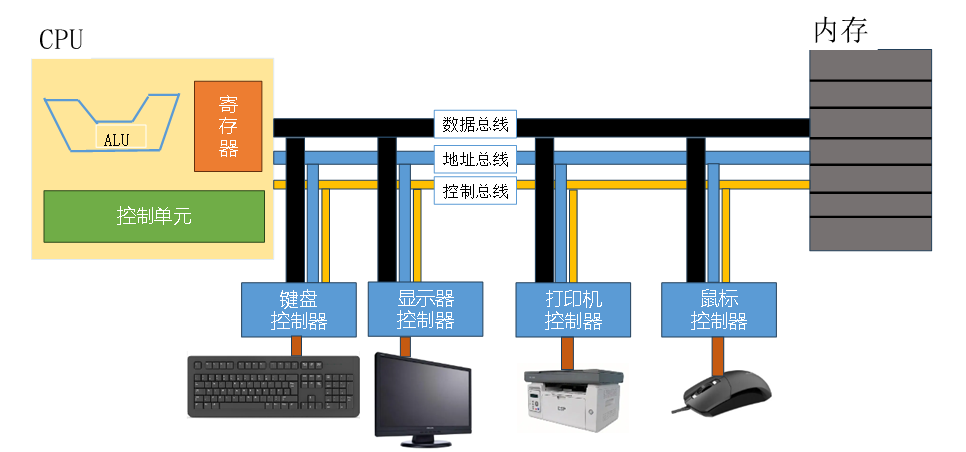
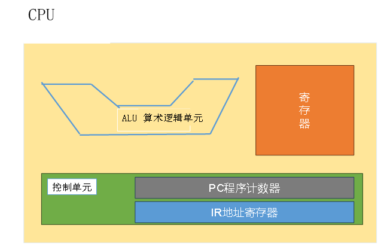
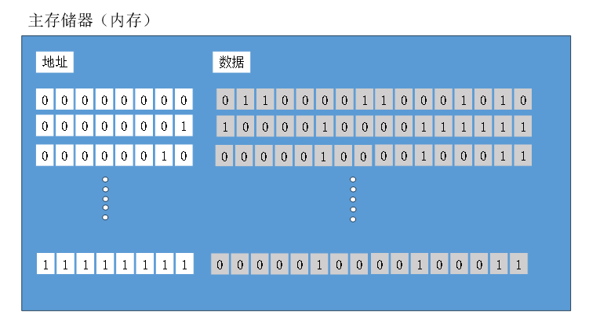
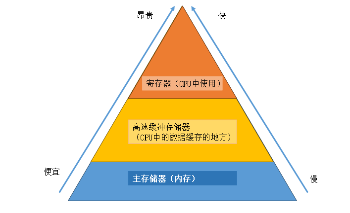
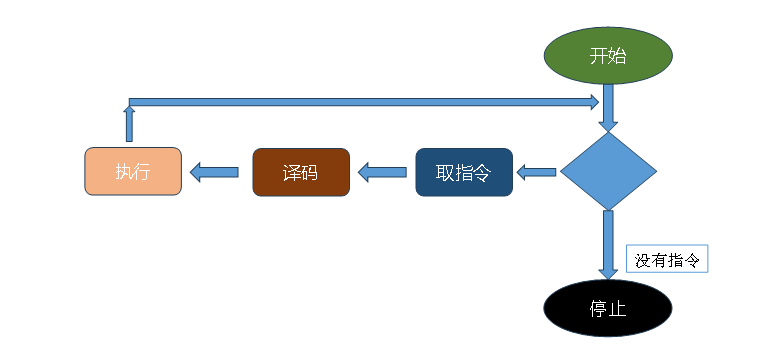
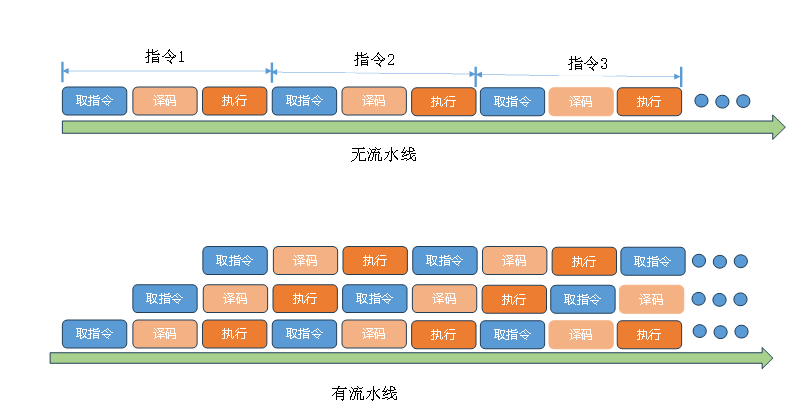

# 第二章：计算机组成原理

## 1.冯诺依曼模型的计算机

**由科学家冯诺依曼提出的模型理论。基于通用图灵机建造的计算机都是在存储器（内存/寄存器）上存储数据。鉴于程序和数据在逻辑上是相同的，因此程序也能存储在计算机的存储器中**

**冯诺依曼模型的四个子系统：**

- **存储器：用来存储数据和程序的区域**
- **算数逻辑单元（ALU）：用来进行计算（算数运算、逻辑运算、位运算等）的地方**
- **控制单元：对存储器、算数逻辑单元、输入/输出等子系统进行控制操作**
- **输入/输出单元：输入子系统负责从计算机外部接收输入数据，输出子系统负责将计算机处理结果输出到计算机外部**

**冯诺依曼模型中存储程序概念：冯诺依曼模型要求程序也必须存储在存储器(内存)中，现代计算机的存储单元用来存储程序和数据，这意味着程序和数据应该有相同的格式，实际上他们都是以位模式（0和1）存储在内存中**

**冯诺依曼模型中指令的顺序执行：冯诺依曼模型中的一段程序是由一组数量有限的指令组成。控制单元从内存中提取一条指令，解释指令，接着执行指令，也就是说指令是一条接着一条顺序执行的**

---

## 2.计算机组成部件

**计算机组成部件可以分为三大类：中央处理单元(CPU)、主存储器(内存)、输入输出子系统**

---

### 2.1 中央处理单元(CPU)

**CPU用于数据的运算，主要由算数逻辑单元（ALU）、控制单元、寄存器组三部分组成**

**算术逻辑单元：对数据进行逻辑、移位和算数运算**

- **算术运算：整数和浮点数的加减运算**
- **位移运算：逻辑移位运算和算术移位运算**
- **逻辑运算：非、与、或、异或，这些运算的输入数据为二进制模式，运算结果也是二进制模式**

**寄存器：用来存放临时数据的高速独立存储单元**

- **数据存储寄存器：保存运算的中间结果**
- **指令存储器（IR）：CPU从内存中逐条取出指令，并存储在指令存储器中，解释并执行指令**
- **程序计数器（PC）：保存当前正在执行的指令地址，当前指令执行完成后，计数器自动加1，指向下一条指令的内存地址**

**控制单元：控制各个子系统的操作，控制是通过从控制单元到其他子系统的信号来进行的**

---

### 2.2 内存

**内存是存储单元的集合，每个存储单元都有唯一的标识，称为地址。数据以“字”的形式在内存中传入传出，字可以是8位、16位、32位、64位。如果字是8位，一般称为一个字节**

**(1)内存类型：RAM和ROM**

- **随机存取存储器（RAM）特点：系统断电后，信息（程序或数据）丢失**
- **只读存储器（ROM）特点：里面的数据由制造商写进去，用户只能读不能写。系统断电数据不会丢失。常用来存储那些在开机时运行的程序**

**(2)存储器的层次：**

**(3)高速缓存寄存器：存储数据的速度比内存快，比寄存器慢。通常容量较小，被置于CPU和主存储器（内存之间）**

**(4)CPU和存储器的连接：**

- **CPU与主存储器之间通常由称为总线的三组线路进行连接。他们分别是：数据总线、地址总线、控制总线**
- **数据总线：由多根线组成，每根线每次传送1个位的数据。线的数量取决于计算机字的大小。例如：计算机的字是32位（4个字节），那么需要32根线的数据总线，以便同一时刻同时传送32位的数据**
- **地址总线：允许访问存储器中的某个字的。地址总线的线数取决于存储空间的大小。例如：存储器的容量为2的n次方个字，那么地址总线一次需要传送n位的地址数据，因此需要n根线**
- **控制总线：负责传送指令的。例如：如果计算机有2的m次方条控制命令，那么控制总线就需要有m根**

---

### 2.3 输入/输出(I/O)系统

**可以使计算机与外界进行通信，并在断电情况下存储程序和数据，分为两大类：非存储设备和存储设备**

- **非存储设备：键盘、鼠标、显示器、打印机等**
- **存储设备：也称为辅助存储设备，通常有磁介质和光介质两种。特点是便宜，断电后数据不丢失**

**(1)I/O设备的连接**

- **输入/输出设备不能直接与CPU和内存的总线相连接，因为输入/输出设备本质与CPU和内存的本质不同，输入/输出设备都是磁性或光学设备，而CPU和内存是电子设备。与CPU和内存相比，输入/输出设备的数据读取速度要慢的多，因此必须要有一个中介来处理这种差异，即输入/输出控制器**
- **输入/输出控制器：连接输入/输出设备到总线上，每一个输入/输出设备都有一个特定的控制器**
- **I/O设备的连接控制器：控制器清除了输入/输出设备与CPU以及内存在本质上的障碍，控制器可以是串行或并行的设备**
- **常用控制器：SCSI、火线、USB和HDMI**

---

### 2.4 程序的执行

**通用计算机使用程序的一系列指令来处理数据，通过执行程序，将输入数据转换为输出数据。程序和数据都放在内存中**

**CPU利用重复的机器周期来执行程序中的指令，一步一条，从开始到结束。一个周期包括3步：取指令、译码、执行**

**(1)取指令：CPU的控制单元命令系统将下一条将要执行的指令复制到CPU的指令寄存器中，被复制的指令地址保存到程序计数器中，复制完成后，程序计数器自动加1，指向内存中的下一条指令**

**(2)译码：当指令置于指令寄存器后，该指令将由控制单元负责译码，指令译码的结果是产生一系列系统可执行的二进制代码**

**(3)执行：指令译码完毕后，控制单元发送任务命令到CPU的某个部件，例如：控制单元告知系统，让它从内存中读取数据。这就是执行阶段**

---

### 2.5 不同的计算机体系结构：CICS、RISC

**(1)复杂指令集计算机体系结构(CICS)**

- **设计策略：是使用大量的指令，包括复杂指令**
- **优点：程序设计更容易，因为每个简单或复杂的任务都有一条对应的指令。程序员不需要写一大堆的指令去完成复杂的任务**
- **缺点：指令集的复杂性使得CPU和控制单元电路非常复杂**
- **优化方案：程序在两个层面上运行，CPU不直接执行机器语言指令，CPU只执行被称为微操作的简单操作，复杂指令被转化为一系列简单操作后由CPU执行，使用微操作的程序设计被称为微程序设计**
- **应用：英特尔公司开发的奔腾系列CPU**

**(2)精简指令集计算机体系结构(RISC)**

- **设计策略：是使用少量的指令完成最少的简单操作**
- **缺点：程序设计更难，复杂指令需要用简单指令模拟**

**(3)流水线：计算机对每条指令都进行取指令、译码、执行三个阶段。早期计算机每条指令的这三个阶段需要串行完成，现代计算机使用流水线技术改善吞吐量（单位时间内完成的指令总数）。如果控制单元能同时执行两个或三个阶段，那么下一条指令就可以在前一条指令完成前开始**

