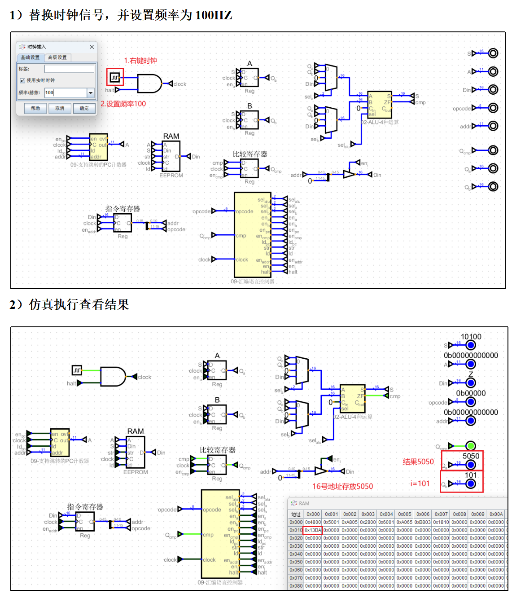

# 第四章：设计汇编语言

## 1.用自己的汇编语言编写程序

**第三章的例子过于简单，体现不出我们系统的强大，接下来我们来实现一段程序。0到100求和**


```c
int main() 
{
    int s=0;
    for (int i=1;i!=101;i++) 
    {
        s+=i;
    }
}
```

**其汇编语言代码如下：**

```c
main:
        //将rbp压栈
        push    rbp
        //将rsp的值赋给rbp
        mov     rbp, rsp
        //将rbp低8位指针指向的值赋0（[rbp-4]就是s变量的指针地址）
        mov     DWORD PTR [rbp-4], 0
        //将rbp低8位指针指向的值赋1（[rbp-8]就是i变量的指针地址）
        mov     DWORD PTR [rbp-8], 1
        //跳到.L2标签
        jmp     .L2 
.L3:
        //将i的值赋给eax寄存器
        mov     eax, DWORD PTR [rbp-8]
        //将eax寄存器的值加到s
        add     DWORD PTR [rbp-4], eax
        //将i的值加1
        add     DWORD PTR [rbp-8], 1
.L2:
        //比较i和100，结果保存到比较寄存器
        cmp     DWORD PTR [rbp-8], 101
        //比较寄存器不为1（不相等），跳到.L3标签
        jne     .L3
        //将0赋给eax寄存器
        mov     eax, 0
        //弹栈，赋给rbp（相当于rbp恢复道进入函数之前）
        pop     rbp
        //函数结束
        ret
```

**尽管我们自己设计的汇编语言没有编译器，但是我们可以仿照上面的x86汇编将上面的代码复刻一段并在我们自己的CPU上执行**

```c
//给寄存器a赋值0
1.ld_ia 0
//给寄存器b赋值1
2.ld_ib 1
//跳到第5条指令
3.jmp 5
//a=a+b
4.add 0 将寄存器ab相加保存到a
//b=b+1
5.add_ib 1
//比较b和101
6.cmp_b 101
//不相等跳到第3条指令
7.jne 3
//将a保存到地址16
8.save_a 16
//停止程序
9.halt
```

**翻译成二进制代码如下：**

```c
0b0100100000000000         ld_ia  0              0
0b0101000000000001         ld_ib  1              1
0b1010100000000101         jmp    5              2
0b0010100000000000         add    0              3
0b0110000000000001         add_ib 1              4
0b1010000001100101         cmp_b  101            5
0b1011100000000011         jne 3                 6
0b0001100000010000         save_a 16             7
0b0000000000000000         halt                  8
```

**烧录进eeprom，将时钟频率调整位500，开始仿真，程序结束后注意观察内存中16地址的值**

---

## 2.测试运行

