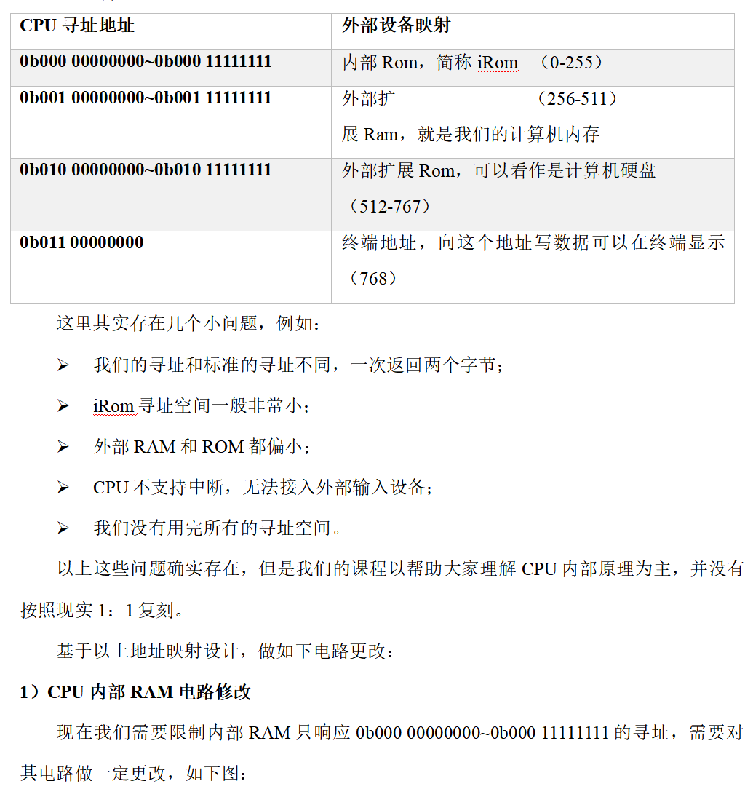

# 第五章：设计总线与其他IO设备

## 1.CPU电路


---

## 2.什么是总线

**总线，在前面的课程中我们有过介绍，但是没有相应的实物，看起来比较抽象，其实总线就是CPU和外部通讯的导线，如果我们将CPU结构稍作改造，例如下图：**


---

## 3.总线地址映射

**现代计算机中，一种解决方案是，采用CPU地址映射的方式来区别外部设备。例如，我们的A信号（寻址信号）长度为11位，我们可以用其中的3位表示总线上的设备编号，后8位表示总线上的外部设备的内部地址，就可以对设备进行区分。来看如下指令：**

```c
ld_a    0b010 00000000
save_a  0b001 00000000
```

**按照我们之前学习的知识，上面这段指令的意思是从0b010 00000000读取数据，写入到0b001 00000000地址。但是如果我们按照总线地址映射的方式来看，这两句的指令的意思就是：**

```c
// 从第三个设备的00000000地址读取数据
ld_a    0b010 00000000
// 保存到第二个设备的00000000地址
save_a  0b001 00000000
```

**这样我们就可以通过简单的寻址动作，完成CPU和外部设备通信。接下来，我们来完成CPU外部地址映射的设计：**




