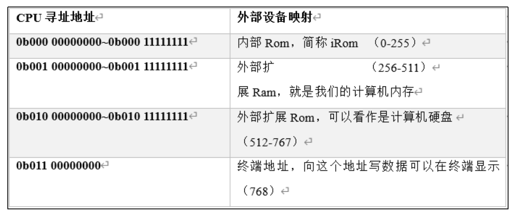
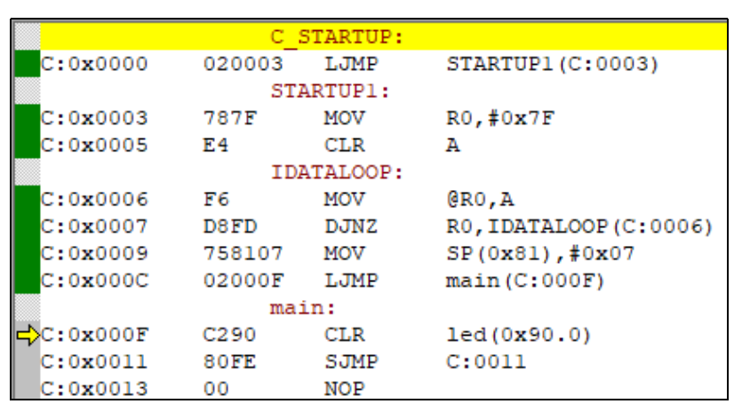

# 第六章：设计引导程序

**现代计算机的开机通常要经历一个复杂且精心设计的过程，这个过程叫做引导。引导是计算机启动和运行操作系统的初始步骤，它确保了系统能够正确地加载和执行所需的程序。引导过程随CPU架构不同而不同，我们平常接触最多的是x86架构的引导，而后面的课程我们主要涉及单片机以及ARM架构的引导**

---

## 1.引导流程设计

**目前我们的计算机总共有三块存储：**

- **iRom：CPU内部很小的一块存储，只读**
- **内存：无法持久化保存数据，只有上电之后才能由程序修改**
- **硬盘：存放我们的自定义代码和数据**

**CPU在上电之后首先会去执行iRom的代码，这一段代码应该是写死在CPU内部不能修改的，所以这一段代码的主要作用应该是引导CPU去执行我们的自定义代码。而我们的自定义代码存放在硬盘上，直接执行效率很低，需要将硬盘里面的数据加载到内存执行。所以CPU的iRom代码应主要功能应该是：**

- **将硬盘中的程序拷贝到内存**
- **跳转到内存地址接着执行**

**但这里存在一个问题：我们的程序长度是不固定的，但iRom只能加载固定长度的数据到内存。为了容纳更长的程序，这个固定长度只能预先设计的非常大；但这样又会造成引导效率太低。所以为了解决这个问题，我们做这样一个约定：iRom只加载一段固定长度的短程序并执行，这段短程序再负责加载更长的我们的自定义程序。由于这段短程序我们可以自定义，就不存在之前的问题了。所以最终的设计如下：**

- **iRom负责将硬盘前32个寻址长度的程序加载到内存并跳转**
- **硬盘前32个寻址长度负责加载自定义程序并跳转**
- **最终执行自定义程序**

**而硬盘前32个寻址地址存放的程序，我们就称之为引导程序，而这32个寻址地址，我们称之为引导区**

---

## 2.程序实现




### 2.1 iRom的实现
```c
// 向寄存器b写0
0	ld_ib		0
// 下两句话是将16地址的指令（jmp 10）拷贝到511地址，根据我们前面做的映射，511地址实际上指向内存空间
1	ld_a		16
2	save_a		511
// 下面三句话是将14地址的指令（ld_a 512）加上寄存器b后拷贝到509
3	ld_a		14
4	add			0
5	save_a		509
// 下面三句话是将15地址的指令（save_a 256）加上寄存器b后拷贝到510
6	ld_a		15
7	add			0
8	save_a		510
// 跳转到509。截止现在509、510、511有三条指令（ld_a 512、save_a 256、jmp 10）合起来表示将512地址的内容拷贝到256，并跳转到10地址继续执行
9	jmp			509
// 从511跳转回来后给b累加1，拷贝下一个地址（从513拷贝到257）。如果b等于32，则结束循环
10	add_ib		1
11	cmp_b		32 （所以只能循环0-31，32次，比较后的结果会存储在比较寄存器）
12	jne			3
// 执行到这里说明相等了，证明32条内存的指令已经都拷贝到了内存中。
跳转到内存中的256地址继续执行
13	jmp			256
// 指令模板，以下三行不会执行
14	ld_a		512
15	save_a		256
16	jmp			10
```

**上面的程序可以实现将地址512-543（硬盘）的内容拷贝到地址256-287（内存），并跳转到256（内存）继续执行，而根据主线地址映射，512-543是硬盘的头32地址，256-287是内存的头32地址，所以这一段程序可以将硬盘的程序拷贝到内存并执行**

**将这段代码翻译为二进制：**

```c
v2.0 raw
5000
810
19ff
80e
2800
19fd
80f
2800
19fe
a9fd
6001
a020
b803
a900
a00
1900
a80a
```

**保存为“CPU内置iROM.hex”，并加载到CPU内置的iRom上**

---

### 2.2 硬盘代码

**硬盘511-543之间的代码，已经被上面的引导程序拷贝到了内存中，即便我们硬盘当前只有17条指令，也就是只有511-528是实际有效的拷贝。但引导程序仍然会将511-543之间的程序全部拷贝过去。因为CPU中的引导程序是不可修改的**

```c
0	ld_ib		0
1	ld_a		272
2	save_a		511
3	ld_a		270
4	add			0
5	save_a		509
6	ld_a		271
7	add			0
8	save_a		510
9	jmp			509
10	add_ib		1
11	cmp_b		25
12	jne			259
13	jmp			288
14	ld_a		544
15	save_a		288
16	jmp			266
```

**这段代码的内容和上面的iRom内容类似，主要作用是将硬盘544-568地址之间的程序拷贝到内存288-312地址并执行，由于这一段代码我们可以自定义，拷贝的长度是和程序相关的**

```c
32	ld_ia		72                  H
33	save_a		768
34	ld_ia		101                 e
35	save_a		768
36	ld_ia		108                 l
37	save_a		768
38	ld_ia		108                 l
39	save_a		768
40	ld_ia		111                 o
41	save_a		768
42	ld_ia		32                  空格
43	save_a		768
44	ld_ia		119                 w
45	save_a		768
46	ld_ia		111                 o
47	save_a		768
48	ld_ia		114                 r
49	save_a		768
50	ld_ia		108                 l
51	save_a		768
52	ld_ia		100                 d
53	save_a		768
54	ld_ia		33                  !
55	save_a		768
```

**这段代码主要就是将一个个数字存到768地址。根据总线地址映射，这个地址实际上是终端的数据输入结构，换句话说我们每次保存的数据，在下个时钟周期就会在终端显示出来**

**将这段代码翻译成二进制文件：**

```c
v2.0 raw
5000
0910
19FF
090E
2800
19FD
090F
2800
19FE
A9FD
6001
A019
B903
A920
0A20
1920
A90A
15*0
4848
1b00
4865
1b00
486c
1b00
486c
1b00
486f
1b00
4820
1b00
4877
1b00
486f
1b00
4872
1b00
486c
1b00
4864
1b00
4821
1b00
```

**将上面的内容保存为“外置引导 + 程序.hex”，并加载到外置EEPROM里面**

---

### 2.3 执行代码

**将时钟频率设置为50，开启仿真，在仿真的过程中，右键点击RAM并监视RAM内容的变化。可以看到RAM的地址内部不断有数据被拷贝进来并执行。最后会在终端上显示“Hello world！”**

---

## 3.单片机引导流程

**单片机引导流程要比一般x86计算机简单。我们可以把单片机视为ROM和RAM都内置在CPU中，只暴露一些输入输出总线接口和外部通信的设备。那么引导过程其实就相当于在ROM上直接执行程序，只有需要用到RAM时才会向RAM中写入数据，并不需要向一般PC引导过程一样需要多步跳转。以我们马上就要学习的51单片机为例，我们来看一下单片机的引导程序**

**来看如下代码：**

```c
#include <REG52.h>

sbit led = P1^0;

void main() {
	led = 0;
	while(1);
}
```

**这是一个简单的51单片机点灯程序。至于这个程序为什么能够点灯，我们这里不去关心，我们着重要看的是，单片机从上电到执行到我们的main函数，都经历了哪些过程。当我们开启单片机的调试程序。将程序编译，并开启调试模式，可以看到我们程序编译完成以后的汇编文件如下：**



**可以看到我们的mian函数的指令地址是0x000F，而第一条指令0x0000的作用是跳转到0x0003，从0x0003到0x000C这一段代码其实是51单片机的固定初始化流程，当这段代码执行完毕后，最后一句0x000C的代码就是跳转到0x000F，而0x000F就是我们的main函数入口了。这就是51单片机的引导过程了，可以看到由于单片机的结构简单，它的引导过程甚至没有我们设计的CPU复杂**